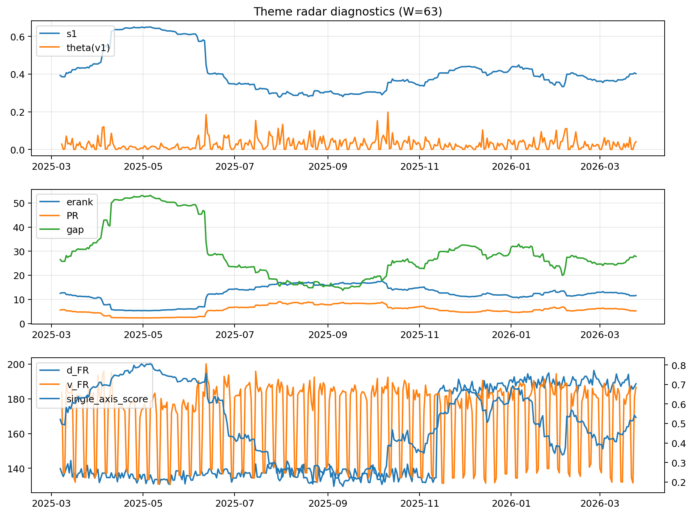

# Theme Radar Daily Brief — 2026-03-25

## Leaders (v1) — W=63
- **Nuclear_Uranium** (0.0828269246152536)
- Semis (0.0644884589975229)
- Genomics_Bio (0.0590929386444554)

## Challengers — W=63
**v2:** Rates (0.1088118197136506), Software_Cloud (0.0690299129649065), Crypto (0.0654693157029222)
**v3:** Metals (0.0874456144705448), Software_Cloud (0.0807128626884114), Nuclear_Uranium (0.0752959952388242)

## Migration (20D slope) — W=63
**Top risers:**
- axis_MegaCap_AI: 0.0005173961529366
- axis_Rates: 0.0004125072715285
- axis_Credit: 0.0003058568954798
- axis_Sector_Comm: 0.0001856004151807
- axis_Sector_Health: 0.000169762528884
- axis_Genomics_Bio: 0.0001644189098404
- axis_USD: 0.0001502376873021
- axis_Sector_RealEstate: 0.0001487512197942
- axis_DataCenter_Infra: 0.0001434926251066
- axis_Sector_ConsStap: 0.0001213408561649

**Top fallers:**
- axis_Defense: -0.0001063422702019
- axis_Drones_Autonomy: -0.0001107070898146
- axis_Miners: -0.0001127401207293
- axis_Space: -0.0001484335156585
- axis_Clean_Broad: -0.0001636999825619
- axis_Critical_Minerals: -0.0001645911853048
- axis_Crypto: -0.0002531005486311
- axis_Metals: -0.0002604432015318
- axis_Quantum: -0.0003401280675981
- axis_Nuclear_Uranium: -0.0004898687151606

## Risk line (W=63)
- s1: 0.4022556681689646
- theta_v1: 0.0409695056246149
- v_FR: 186.6260252758928
- single_axis_score: 0.5307291666666666

## Interpretation
**Regime:** `theme_migration`

- Action: Tomorrow watchlist: MegaCap_AI, Rates, Credit, Sector_Comm, Sector_Health + v2_top1=Rates
- Action: Hedge note: normal correlation stability.

- Percentiles (W=63 history): vfr_pct=0.82, theta_pct=0.77, s1_pct=0.58, score_pct=0.54.

---
**BUNDLE_ROOT_SHA256:** `5ed8416146edd508be90b549a48d5eae631fd73f33a79f3eb620dc7e152124a4`
