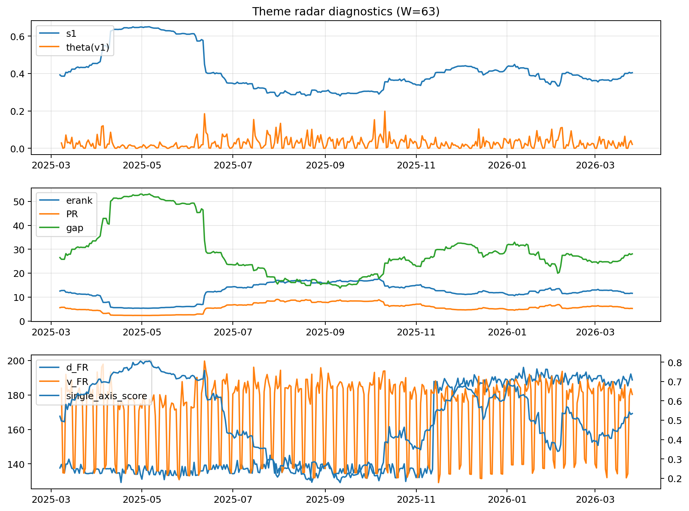

# Theme Radar Daily Brief — 2026-03-26

## Leaders (v1) — W=63
- **Nuclear_Uranium** (0.0819812711620857)
- Semis (0.0642428813721461)
- Genomics_Bio (0.0579740381345934)

## Challengers — W=63
**v2:** Rates (0.1132714846434291), Software_Cloud (0.070450538046267), Crypto (0.0673007303965364)
**v3:** Metals (0.0860883229409831), Software_Cloud (0.0793257094463406), Nuclear_Uranium (0.0771816610618911)

## Migration (20D slope) — W=63
**Top risers:**
- axis_Rates: 0.0004998866253551
- axis_MegaCap_AI: 0.0004380759807691
- axis_Credit: 0.0002998706268678
- axis_Sector_Comm: 0.0001621548493343
- axis_USD: 0.0001610714362552
- axis_Sector_Health: 0.0001570209631488
- axis_Genomics_Bio: 0.0001427080209403
- axis_Sector_RealEstate: 0.0001406695851148
- axis_Sector_ConsStap: 0.0001329144588127
- axis_Sector_Utilities: 0.0001203457889433

**Top fallers:**
- axis_Equity_US: -8.200026456821713e-05
- axis_Defense: -8.243049919571468e-05
- axis_Space: -9.352226080298436e-05
- axis_Cyber: -9.365917248525284e-05
- axis_Critical_Minerals: -0.0001397376227252
- axis_Clean_Broad: -0.0001711281592665
- axis_Metals: -0.0001785443708594
- axis_Crypto: -0.0002915097893744
- axis_Quantum: -0.0003145981532665
- axis_Nuclear_Uranium: -0.0004764504774814

## Risk line (W=63)
- s1: 0.404245884808982
- theta_v1: 0.0209967735796208
- v_FR: 180.30710865642624
- single_axis_score: 0.5345454545454544

## Interpretation
**Regime:** `theme_migration`

- Action: Tomorrow watchlist: Rates, MegaCap_AI, Credit, Sector_Comm, USD + v2_top1=Rates
- Action: Hedge note: normal correlation stability.

- Percentiles (W=63 history): vfr_pct=0.49, theta_pct=0.52, s1_pct=0.59, score_pct=0.55.

---
**BUNDLE_ROOT_SHA256:** `47cf9fb742eb0148ab9298c770f15f8d48d4cf76fb80c78e7326861a049a402b`
