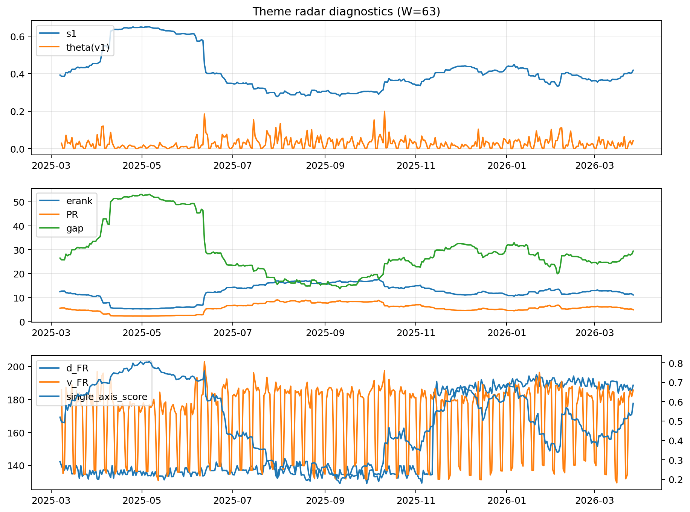

# Theme Radar Daily Brief — 2026-03-27

## Leaders (v1) — W=63
- **Nuclear_Uranium** (0.0815332476673215)
- Semis (0.0652142556759686)
- Quantum (0.0549974670873651)

## Challengers — W=63
**v2:** Rates (0.1083487005965049), Software_Cloud (0.0756614984849027), Crypto (0.0725015432475947)
**v3:** Metals (0.0911419775773677), Nuclear_Uranium (0.078102380277911), Software_Cloud (0.0775109055906156)

## Migration (20D slope) — W=63
**Top risers:**
- axis_Rates: 0.0006440339429519
- axis_MegaCap_AI: 0.0004007596061703
- axis_Credit: 0.000315346240579
- axis_USD: 0.000170785211328
- axis_Sector_Comm: 0.0001665980122343
- axis_Sector_ConsStap: 0.0001432547228302
- axis_Sector_Health: 0.0001397670429178
- axis_Sector_RealEstate: 0.0001389100749074
- axis_Sector_Utilities: 0.0001273824300156
- axis_DataCenter_Infra: 0.0001113232932457

**Top fallers:**
- axis_Semis: -7.500879732916267e-05
- axis_Robotics: -8.277120065491443e-05
- axis_Equity_US: -0.0001015425293097
- axis_Cyber: -0.0001134883008911
- axis_Metals: -0.0001205856090472
- axis_Critical_Minerals: -0.0001265164467283
- axis_Clean_Broad: -0.000182328677391
- axis_Quantum: -0.0003166371512266
- axis_Crypto: -0.000326854259653
- axis_Nuclear_Uranium: -0.0004841892458047

## Risk line (W=63)
- s1: 0.4185477903563599
- theta_v1: 0.0427502906986681
- v_FR: 185.6725657755729
- single_axis_score: 0.5911917098445596

## Interpretation
**Regime:** `theme_migration`

- Action: Tomorrow watchlist: Rates, MegaCap_AI, Credit, USD, Sector_Comm + v2_top1=Rates
- Action: Hedge note: normal correlation stability.

- Percentiles (W=63 history): vfr_pct=0.79, theta_pct=0.78, s1_pct=0.67, score_pct=0.61.

---
**BUNDLE_ROOT_SHA256:** `2247b561e892c8a58836d020e5a2881c1c57cc199e5695754d04b18da002be06`
