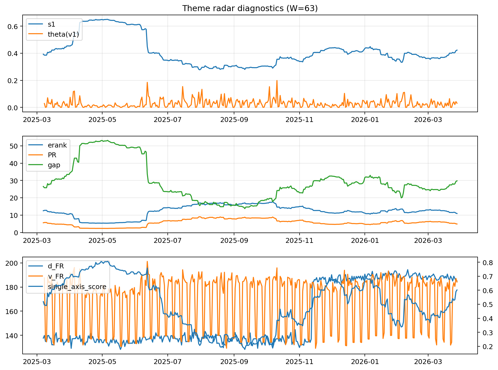

# Theme Radar Daily Brief — 2026-03-28

## Leaders (v1) — W=63
- **Nuclear_Uranium** (0.0804437351147474)
- Semis (0.065085973045059)
- Genomics_Bio (0.0568494834438386)

## Challengers — W=63
**v2:** Rates (0.0907055248569835), Software_Cloud (0.0876426954859838), Crypto (0.0751985273397876)
**v3:** Metals (0.0925644308868741), Nuclear_Uranium (0.0889387006353149), Rates (0.0814863057532114)

## Migration (20D slope) — W=63
**Top risers:**
- axis_Rates: 0.0007513680107786
- axis_MegaCap_AI: 0.0003764765758066
- axis_Credit: 0.0003228189455716
- axis_USD: 0.000178900743973
- axis_Sector_Comm: 0.0001723363996721
- axis_Sector_ConsStap: 0.0001425776853268
- axis_Sector_RealEstate: 0.0001365834002189
- axis_Sector_Utilities: 0.0001266809625616
- axis_Sector_Health: 0.0001250199829541
- axis_DataCenter_Infra: 9.779287775060168e-05

**Top fallers:**
- axis_Metals: -9.504662209798424e-05
- axis_Semis: -0.0001000125054512
- axis_Grid_Power: -0.0001000188331728
- axis_Cyber: -0.000113976034418
- axis_Equity_US: -0.0001164075952288
- axis_Critical_Minerals: -0.0001340500339262
- axis_Clean_Broad: -0.0001939512559855
- axis_Quantum: -0.0003033031900068
- axis_Crypto: -0.0003483273000888
- axis_Nuclear_Uranium: -0.0004957803593995

## Risk line (W=63)
- s1: 0.4228627265863169
- theta_v1: 0.0308256077049927
- v_FR: 184.1960287889482
- single_axis_score: 0.6020671834625324

## Interpretation
**Regime:** `theme_migration`

- Action: Tomorrow watchlist: Rates, MegaCap_AI, Credit, USD, Sector_Comm + v2_top1=Rates
- Action: Hedge note: normal correlation stability.

- Percentiles (W=63 history): vfr_pct=0.68, theta_pct=0.65, s1_pct=0.68, score_pct=0.63.

---
**BUNDLE_ROOT_SHA256:** `aa5d34d928b01a4223b13cef7a72f552703a443004a32c96a8ceeaf293d6a624`
