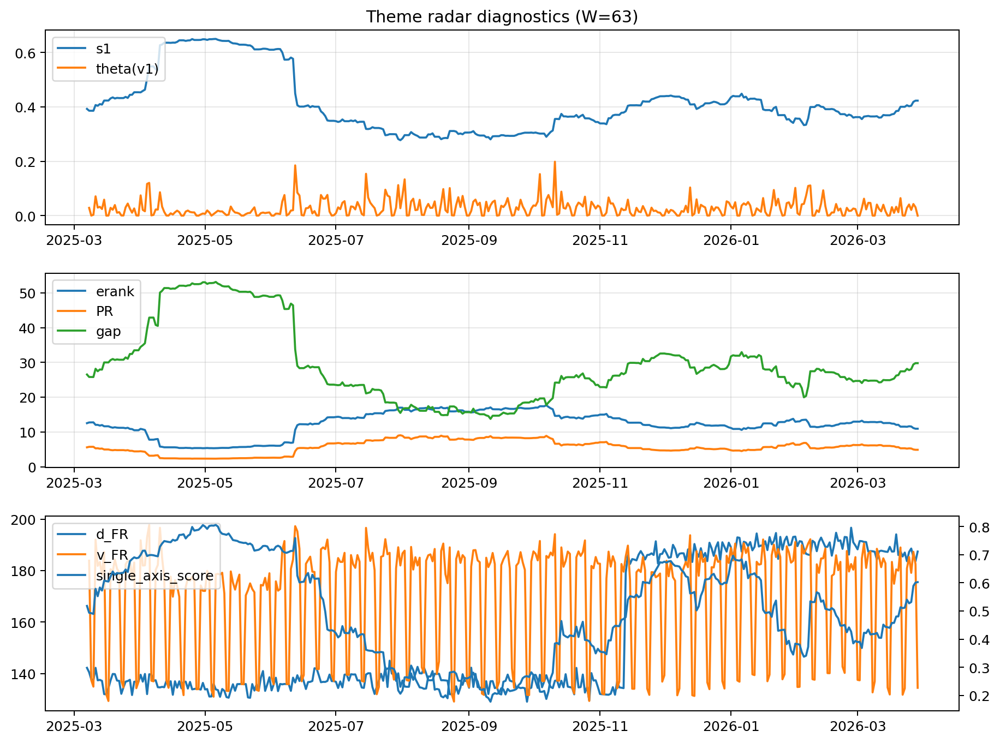

# Theme Radar Daily Brief — 2026-03-29

## Leaders (v1) — W=63
- **Nuclear_Uranium** (0.0804434505892125)
- Semis (0.0650854561482305)
- Genomics_Bio (0.0568494050147658)

## Challengers — W=63
**v2:** Rates (0.0906938073331517), Software_Cloud (0.0876452466368764), Crypto (0.0752098238725859)
**v3:** Metals (0.0925589037963992), Nuclear_Uranium (0.0889416930612962), Rates (0.0814947263995572)

## Migration (20D slope) — W=63
**Top risers:**
- axis_Rates: 0.0008407606122435
- axis_MegaCap_AI: 0.0003387725757777
- axis_Credit: 0.0003222765175192
- axis_USD: 0.0001817009573203
- axis_Sector_Comm: 0.0001734072147129
- axis_Sector_ConsStap: 0.0001386006651495
- axis_Sector_RealEstate: 0.000131896660678
- axis_Sector_Utilities: 0.0001236407260804
- axis_Sector_Health: 0.0001065116822691
- axis_Sector_ConsDisc: 9.589993314079266e-05

**Top fallers:**
- axis_Sector_Energy: -9.306249194889572e-05
- axis_Cyber: -0.0001113769452548
- axis_Semis: -0.0001254219474886
- axis_Equity_US: -0.0001285478006885
- axis_Critical_Minerals: -0.0001369670132675
- axis_Grid_Power: -0.0001412650913982
- axis_Clean_Broad: -0.0002010340172972
- axis_Quantum: -0.0002835454409242
- axis_Crypto: -0.0003612297787623
- axis_Nuclear_Uranium: -0.000494025373606

## Risk line (W=63)
- s1: 0.4228656964900273
- theta_v1: 3.0211305969013573e-05
- v_FR: 134.47348598849547
- single_axis_score: 0.6025773195876288

## Interpretation
**Regime:** `theme_migration`

- Action: Tomorrow watchlist: Rates, MegaCap_AI, Credit, USD, Sector_Comm + v2_top1=Rates
- Action: Hedge note: normal correlation stability.

- Percentiles (W=63 history): vfr_pct=0.10, theta_pct=0.01, s1_pct=0.68, score_pct=0.64.

---
**BUNDLE_ROOT_SHA256:** `e829cafef43e2f76eb66f942597c4c6045881bc083eda0b13fc628079487c26b`
