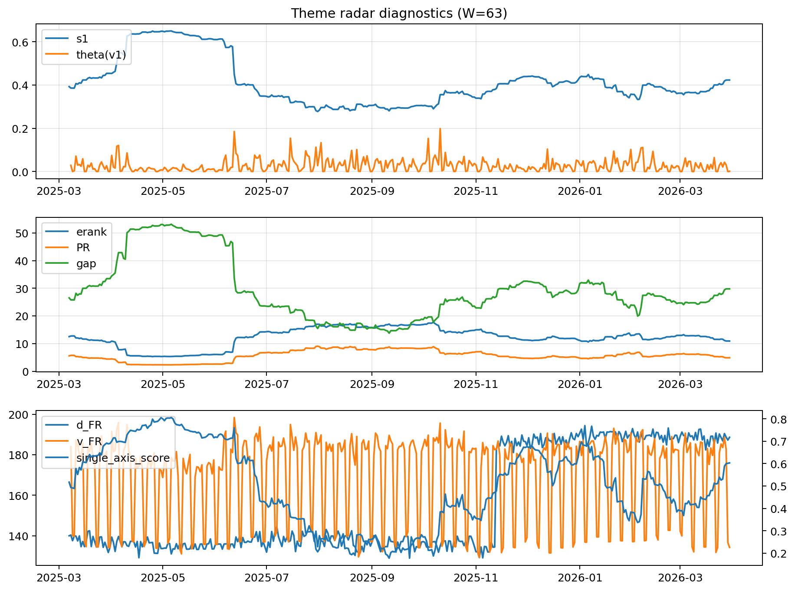

# Theme Radar Daily Brief — 2026-03-30

## Leaders (v1) — W=63
- **Nuclear_Uranium** (0.0804301383895567)
- Semis (0.0650708887439217)
- Genomics_Bio (0.0568421194993115)

## Challengers — W=63
**v2:** Rates (0.0905831005322105), Software_Cloud (0.0876597161392681), Crypto (0.0754696240844625)
**v3:** Metals (0.0924962015492101), Nuclear_Uranium (0.0889788385456329), Rates (0.0815947323272618)

## Migration (20D slope) — W=63
**Top risers:**
- axis_Rates: 0.0009201198044214
- axis_Credit: 0.0003175273312334
- axis_MegaCap_AI: 0.000310508267193
- axis_USD: 0.0001764356567765
- axis_Sector_Comm: 0.0001625011691703
- axis_Sector_ConsStap: 0.0001380713173553
- axis_Sector_Utilities: 0.0001327705369311
- axis_Sector_RealEstate: 0.0001258527132179
- axis_Sector_Health: 9.68002344583298e-05
- axis_Sector_ConsDisc: 8.435704516216291e-05

**Top fallers:**
- axis_Cyber: -0.000113343948862
- axis_Semis: -0.0001240975092495
- axis_Sector_Energy: -0.0001368985699065
- axis_Equity_US: -0.0001391586666898
- axis_Critical_Minerals: -0.0001402829374456
- axis_Grid_Power: -0.0001523334763271
- axis_Clean_Broad: -0.000197733451875
- axis_Quantum: -0.0002710911727171
- axis_Crypto: -0.0003725691348294
- axis_Nuclear_Uranium: -0.0004806852278334

## Risk line (W=63)
- s1: 0.4229889010577057
- theta_v1: 0.0010841860059869
- v_FR: 134.26157806912676
- single_axis_score: 0.6030848329048843

## Interpretation
**Regime:** `theme_migration`

- Action: Tomorrow watchlist: Rates, Credit, MegaCap_AI, USD, Sector_Comm + v2_top1=Rates
- Action: Hedge note: normal correlation stability.

- Percentiles (W=63 history): vfr_pct=0.07, theta_pct=0.20, s1_pct=0.68, score_pct=0.65.

---
**BUNDLE_ROOT_SHA256:** `75c033da6279df18629543b9a17a19fcfabc8860b02b7758ab0fc8ccc7ee4e4e`
