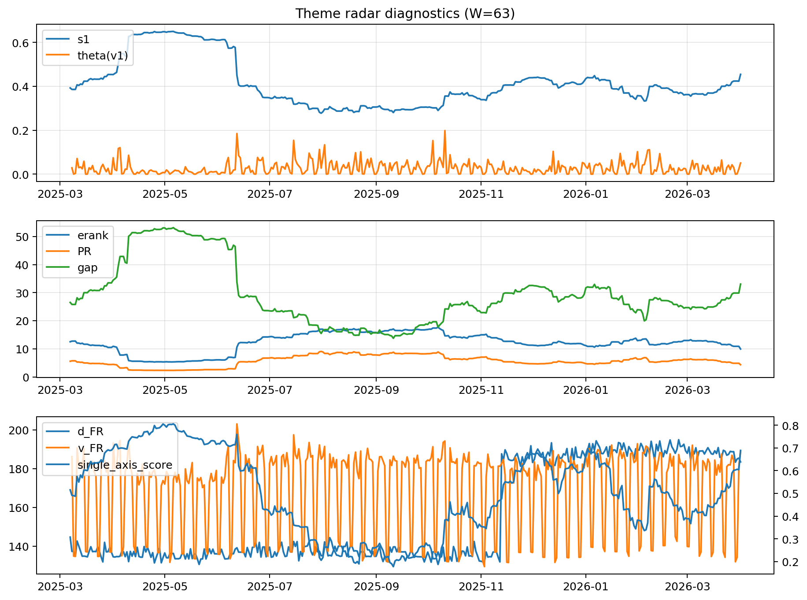

# Theme Radar Daily Brief — 2026-04-01

## Leaders (v1) — W=63
- **Nuclear_Uranium** (0.0785676452895421)
- Semis (0.0651683756932782)
- Genomics_Bio (0.0590755301954132)

## Challengers — W=63
**v2:** Rates (0.0926315691469246), Software_Cloud (0.087817639642623), Crypto (0.0746203442151164)
**v3:** Metals (0.0952063618062197), Rates (0.0905674222543311), Nuclear_Uranium (0.0874239852297134)

## Migration (20D slope) — W=63
**Top risers:**
- axis_Rates: 0.0009212327169111
- axis_MegaCap_AI: 0.0003051390798176
- axis_Credit: 0.0002626732052867
- axis_USD: 0.0001776938578768
- axis_Sector_Comm: 0.0001599962084699
- axis_Sector_ConsStap: 0.0001447048866624
- axis_Sector_Utilities: 0.0001444620292418
- axis_Sector_RealEstate: 0.0001250728210778
- axis_Drones_Autonomy: 0.0001120434146677
- axis_Commodities: 0.000111391317963

**Top fallers:**
- axis_Robotics: -0.0001092094958565
- axis_Semis: -0.0001129959697337
- axis_Equity_US: -0.0001568895911542
- axis_Critical_Minerals: -0.0001675813673159
- axis_Sector_Energy: -0.0001677346883688
- axis_Grid_Power: -0.0001703954043909
- axis_Clean_Broad: -0.000187006284981
- axis_Quantum: -0.0002239300043408
- axis_Crypto: -0.000374343249872
- axis_Nuclear_Uranium: -0.0004370043689726

## Risk line (W=63)
- s1: 0.4544151437513501
- theta_v1: 0.0507045134421499
- v_FR: 188.85561497690932
- single_axis_score: 0.6890025575447569

## Interpretation
**Regime:** `structure_rewrite`

- Action: Tomorrow watchlist: Rates, MegaCap_AI, Credit, USD, Sector_Comm + v2_top1=Rates
- Action: Hedge note: v_FR high + theta high → correlation structure unstable; diversify hedges / reduce reliance on static correlations.

- Percentiles (W=63 history): vfr_pct=0.92, theta_pct=0.84, s1_pct=0.82, score_pct=0.81.

---
**BUNDLE_ROOT_SHA256:** `82f16877a1aacc8e0390309eae4ca9b259149bf6a7cbb6e6c120ccdcc268cdfa`
