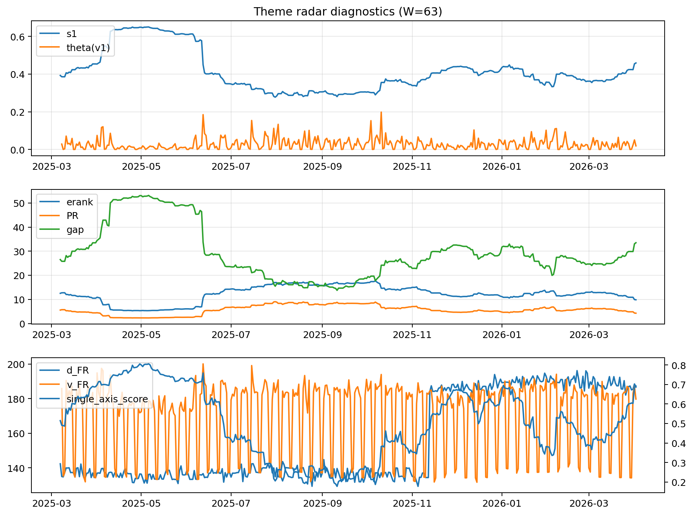

# Theme Radar Daily Brief — 2026-04-02

## Leaders (v1) — W=63
- **Nuclear_Uranium** (0.0795571883547944)
- Semis (0.0654044914638822)
- Genomics_Bio (0.0602365027369808)

## Challengers — W=63
**v2:** Software_Cloud (0.0898689474613727), Rates (0.0836623839972991), Crypto (0.0750971202711855)
**v3:** Metals (0.0945033644726751), Rates (0.0877360403645962), Nuclear_Uranium (0.082998955810798)

## Migration (20D slope) — W=63
**Top risers:**
- axis_Rates: 0.0008316831164184
- axis_MegaCap_AI: 0.000342942641823
- axis_Credit: 0.0002423500153955
- axis_USD: 0.0001830309977743
- axis_Sector_Comm: 0.0001706005973672
- axis_Commodities: 0.0001443484840732
- axis_Sector_ConsStap: 0.0001356187242682
- axis_Space: 0.0001226430485902
- axis_Sector_Utilities: 0.0001212967679145
- axis_Drones_Autonomy: 0.0001206811590166

**Top fallers:**
- axis_Semis: -9.005587451983299e-05
- axis_Robotics: -0.0001185389449962
- axis_Grid_Power: -0.0001643346263648
- axis_Equity_US: -0.0001647972668429
- axis_Clean_Broad: -0.0001848177683822
- axis_Critical_Minerals: -0.0001916371904443
- axis_Sector_Energy: -0.0001943260351727
- axis_Quantum: -0.0002236503969929
- axis_Crypto: -0.0004078335587356
- axis_Nuclear_Uranium: -0.000429092722634

## Risk line (W=63)
- s1: 0.4589072470578587
- theta_v1: 0.0191299176349332
- v_FR: 179.7276346352803
- single_axis_score: 0.6923469387755101

## Interpretation
**Regime:** `theme_migration`

- Action: Tomorrow watchlist: Rates, MegaCap_AI, Credit, USD, Sector_Comm + v2_top1=Software_Cloud
- Action: Hedge note: normal correlation stability.

- Percentiles (W=63 history): vfr_pct=0.45, theta_pct=0.48, s1_pct=0.82, score_pct=0.81.

---
**BUNDLE_ROOT_SHA256:** `1494a00d5508b0188ca7b9d55b88e5381000964c5476fcc6e10f4b88c057d319`
