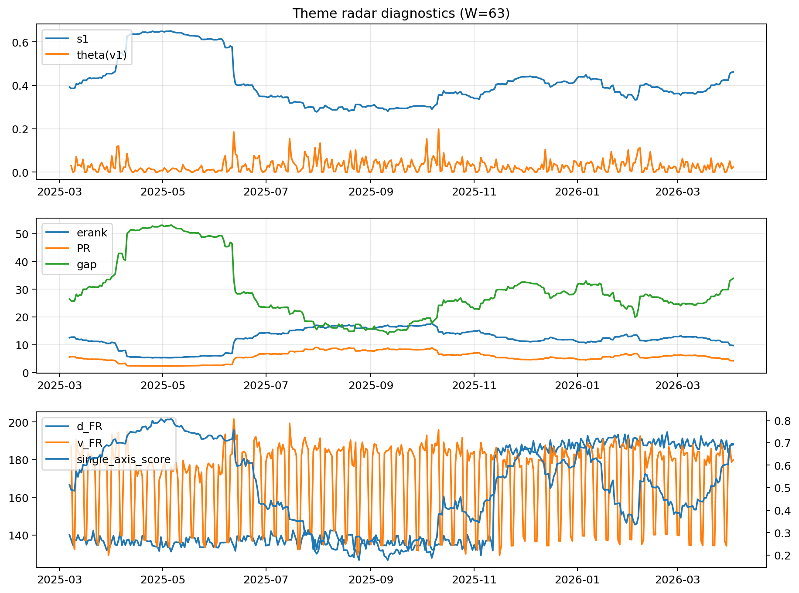

# Theme Radar Daily Brief — 2026-04-03

## Leaders (v1) — W=63
- **Nuclear_Uranium** (0.0792246311142943)
- Semis (0.0651117928277273)
- Genomics_Bio (0.0601422486639625)

## Challengers — W=63
**v2:** Software_Cloud (0.093330249123887), Crypto (0.0702732155128334), Rates (0.0681902235029761)
**v3:** Rates (0.1153757941236222), Nuclear_Uranium (0.0827522615744345), Metals (0.0824077141610822)

## Migration (20D slope) — W=63
**Top risers:**
- axis_Rates: 0.0007703079887327
- axis_MegaCap_AI: 0.0003990582818657
- axis_Credit: 0.0002223617761917
- axis_Sector_Comm: 0.0001939924910336
- axis_USD: 0.0001890179865272
- axis_Commodities: 0.000162987322947
- axis_Drones_Autonomy: 0.0001176451871454
- axis_Sector_Health: 0.0001161212171292
- axis_Sector_ConsStap: 0.0001154304339535
- axis_Sector_RealEstate: 0.0001107485397078

**Top fallers:**
- axis_Sector_Tech: -8.293650951858007e-05
- axis_Robotics: -0.0001308428720462
- axis_Grid_Power: -0.000159458777115
- axis_Equity_US: -0.0001711466003996
- axis_Clean_Broad: -0.0001826829886746
- axis_Critical_Minerals: -0.0002099326666545
- axis_Quantum: -0.0002116935439241
- axis_Sector_Energy: -0.0002157666029937
- axis_Nuclear_Uranium: -0.0004201045096733
- axis_Crypto: -0.0004264008748986

## Risk line (W=63)
- s1: 0.4615506884640484
- theta_v1: 0.0238926352118287
- v_FR: 179.82796466677073
- single_axis_score: 0.6910941475826973

## Interpretation
**Regime:** `theme_migration`

- Action: Tomorrow watchlist: Rates, MegaCap_AI, Credit, Sector_Comm, USD + v2_top1=Software_Cloud
- Action: Hedge note: normal correlation stability.

- Percentiles (W=63 history): vfr_pct=0.46, theta_pct=0.55, s1_pct=0.82, score_pct=0.81.

---
**BUNDLE_ROOT_SHA256:** `9c13c911d7182d4be7d11a77592233e0d11ba9badf69a8c85ba80f7765e57802`
