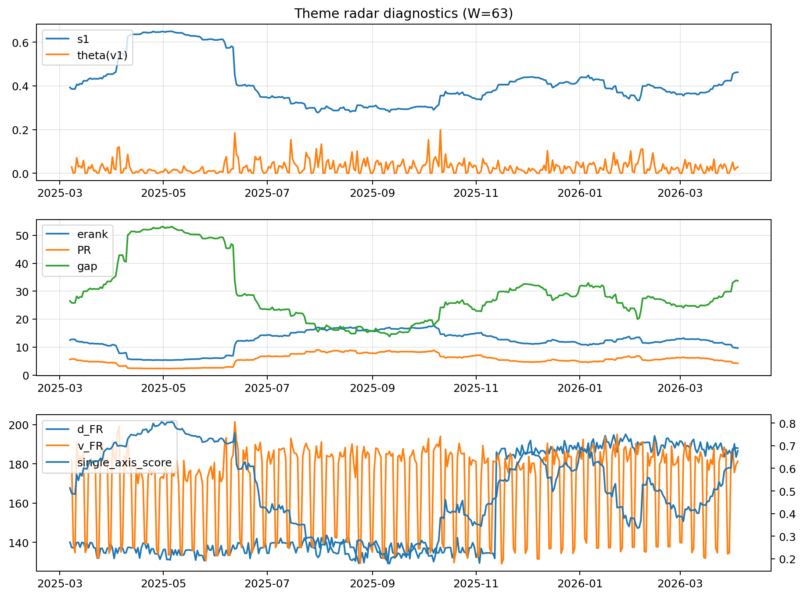

# Theme Radar Daily Brief — 2026-04-04

## Leaders (v1) — W=63
- **Nuclear_Uranium** (0.0780890706766925)
- Semis (0.0647367371061759)
- Genomics_Bio (0.0589117491124926)

## Challengers — W=63
**v2:** Software_Cloud (0.0928121434190898), Rates (0.069086525398448), Crypto (0.0673616401057205)
**v3:** Rates (0.1294015335674409), Nuclear_Uranium (0.0776837129811895), Metals (0.0685975916285056)

## Migration (20D slope) — W=63
**Top risers:**
- axis_Rates: 0.000675781694745
- axis_MegaCap_AI: 0.0004492535946117
- axis_Sector_Comm: 0.0002164051768076
- axis_Commodities: 0.0002013820602253
- axis_Credit: 0.0001991182838659
- axis_USD: 0.0001832156644079
- axis_Sector_Health: 0.0001338917209201
- axis_Sector_ConsStap: 0.00011180937345
- axis_Drones_Autonomy: 0.0001054059970114
- axis_Sector_RealEstate: 0.0001025781736111

**Top fallers:**
- axis_Sector_Tech: -8.231627896643947e-05
- axis_Robotics: -0.0001394614135064
- axis_Grid_Power: -0.0001501980220143
- axis_Equity_US: -0.0001698662278374
- axis_Clean_Broad: -0.0001762121820077
- axis_Quantum: -0.0002018133172277
- axis_Critical_Minerals: -0.0002218488424488
- axis_Sector_Energy: -0.0002385444845438
- axis_Nuclear_Uranium: -0.0004128488024853
- axis_Crypto: -0.0004197542860188

## Risk line (W=63)
- s1: 0.4623390465270112
- theta_v1: 0.029324528245246
- v_FR: 181.34858751294647
- single_axis_score: 0.6893401015228426

## Interpretation
**Regime:** `theme_migration`

- Action: Tomorrow watchlist: Rates, MegaCap_AI, Sector_Comm, Commodities, Credit + v2_top1=Software_Cloud
- Action: Hedge note: normal correlation stability.

- Percentiles (W=63 history): vfr_pct=0.53, theta_pct=0.63, s1_pct=0.82, score_pct=0.81.

---
**BUNDLE_ROOT_SHA256:** `f00562864f8b34bb5147ce8b19c980d3f432076930e60c06796cab3df256e437`
