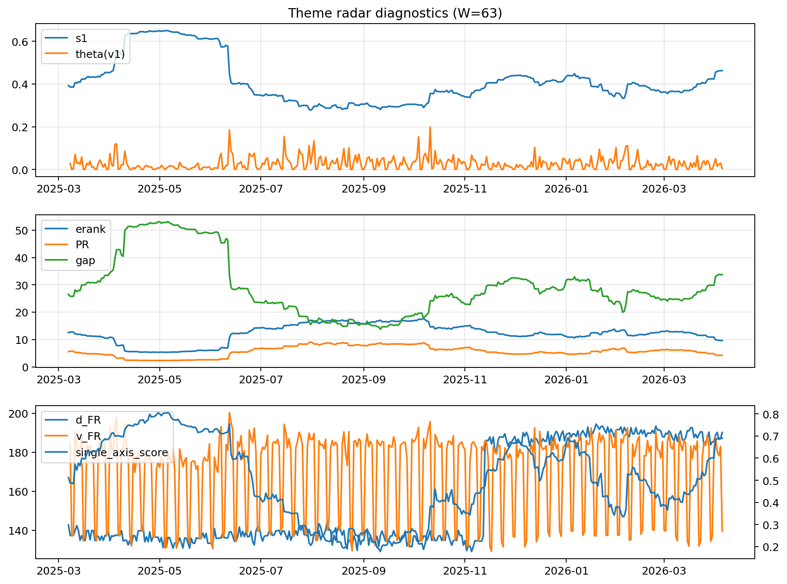

# Theme Radar Daily Brief — 2026-04-05

## Leaders (v1) — W=63
- **Nuclear_Uranium** (0.0780370516055726)
- Semis (0.0646780747709815)
- Genomics_Bio (0.0588701320588731)

## Challengers — W=63
**v2:** Software_Cloud (0.0925791254526437), Rates (0.0693312734549823), Crypto (0.0685281476681363)
**v3:** Rates (0.1293040219758993), Nuclear_Uranium (0.0776482742344915), Metals (0.0686973477654986)

## Migration (20D slope) — W=63
**Top risers:**
- axis_Rates: 0.0005641971743053
- axis_MegaCap_AI: 0.000482505763331
- axis_Commodities: 0.000234588087957
- axis_Sector_Comm: 0.0002304954701883
- axis_USD: 0.0001731072607131
- axis_Credit: 0.0001683301997541
- axis_Sector_Health: 0.0001462881700697
- axis_Sector_ConsStap: 0.0001036863964128
- axis_Drones_Autonomy: 9.17518983998284e-05
- axis_Sector_RealEstate: 8.987760895356327e-05

**Top fallers:**
- axis_Equity_ExUS: -8.613282576092471e-05
- axis_Grid_Power: -0.0001375782006069
- axis_Robotics: -0.0001441953019408
- axis_Equity_US: -0.0001643183395779
- axis_Clean_Broad: -0.0001645787956998
- axis_Quantum: -0.0001822472251894
- axis_Critical_Minerals: -0.0002262510720227
- axis_Sector_Energy: -0.0002559963872044
- axis_Nuclear_Uranium: -0.0003931818479897
- axis_Crypto: -0.0003944170390646

## Risk line (W=63)
- s1: 0.46290683328346
- theta_v1: 0.0047334314406756
- v_FR: 139.53139555963705
- single_axis_score: 0.690126582278481

## Interpretation
**Regime:** `theme_migration`

- Action: Tomorrow watchlist: Rates, MegaCap_AI, Commodities, Sector_Comm, USD + v2_top1=Software_Cloud
- Action: Hedge note: normal correlation stability.

- Percentiles (W=63 history): vfr_pct=0.25, theta_pct=0.28, s1_pct=0.82, score_pct=0.81.

---
**BUNDLE_ROOT_SHA256:** `84498df678906237b78b432f2bf17d89fc553b70b4c3aed245a66aab92dc767b`
