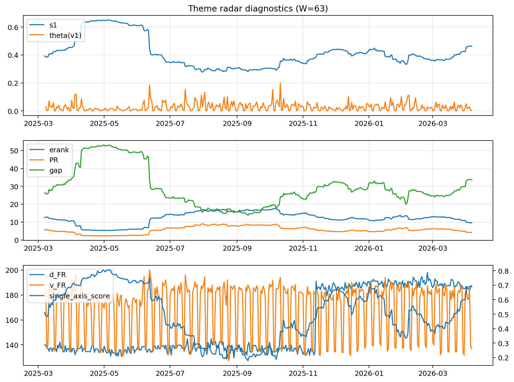

# Theme Radar Daily Brief — 2026-04-06

## Leaders (v1) — W=63
- **Nuclear_Uranium** (0.0780201749217698)
- Semis (0.0646571797331009)
- Genomics_Bio (0.058853892466804)

## Challengers — W=63
**v2:** Software_Cloud (0.0924820325468579), Rates (0.0693695360610522), Crypto (0.0690675629448222)
**v3:** Rates (0.1293301865031603), Nuclear_Uranium (0.0776719143447436), Metals (0.0687161838883642)

## Migration (20D slope) — W=63
**Top risers:**
- axis_MegaCap_AI: 0.0005149257775457
- axis_Rates: 0.0004297001233044
- axis_Commodities: 0.0002590779195581
- axis_Sector_Comm: 0.0002445496185713
- axis_USD: 0.0001641434455486
- axis_Sector_Health: 0.0001598044421844
- axis_Credit: 0.0001486011170937
- axis_Sector_ConsStap: 8.729334621950428e-05
- axis_Sector_RealEstate: 7.74516499057756e-05
- axis_Drones_Autonomy: 7.565337080565908e-05

**Top fallers:**
- axis_Equity_ExUS: -8.84032055619474e-05
- axis_Grid_Power: -0.0001217467132082
- axis_Robotics: -0.000144230249091
- axis_Equity_US: -0.0001539463793677
- axis_Clean_Broad: -0.000154519338652
- axis_Quantum: -0.0001709077577879
- axis_Critical_Minerals: -0.000232244306985
- axis_Sector_Energy: -0.0002642958914405
- axis_Crypto: -0.0003507157088429
- axis_Nuclear_Uranium: -0.0003677678709513

## Risk line (W=63)
- s1: 0.4631071164728308
- theta_v1: 0.0023291889648507
- v_FR: 136.87056252934815
- single_axis_score: 0.6904040404040405

## Interpretation
**Regime:** `theme_migration`

- Action: Tomorrow watchlist: MegaCap_AI, Rates, Commodities, Sector_Comm, USD + v2_top1=Software_Cloud
- Action: Hedge note: normal correlation stability.

- Percentiles (W=63 history): vfr_pct=0.17, theta_pct=0.24, s1_pct=0.82, score_pct=0.82.

---
**BUNDLE_ROOT_SHA256:** `41837c75c8226729ba515df97b5ac8c414e2e4d4ffed42b9c6168de7da5466dd`
