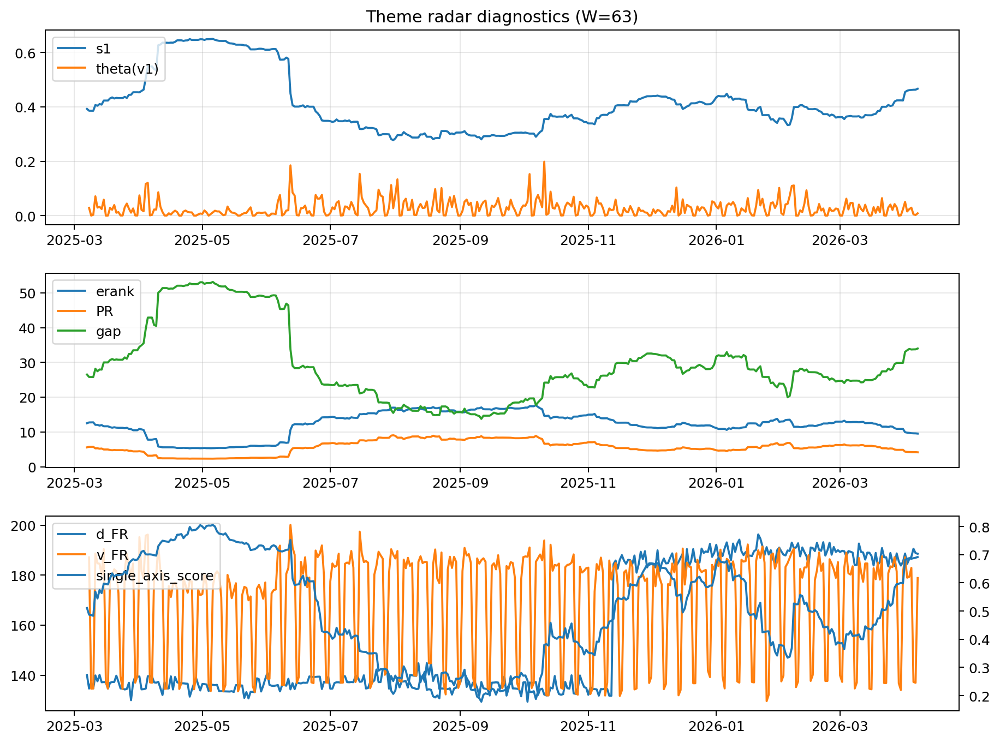

# Theme Radar Daily Brief — 2026-04-07

## Leaders (v1) — W=63
- **Nuclear_Uranium** (0.0783487050953568)
- Semis (0.0646536216290981)
- Genomics_Bio (0.0586827443277221)

## Challengers — W=63
**v2:** Software_Cloud (0.0911984236362549), Rates (0.0703906842341631), Crypto (0.0689517770978195)
**v3:** Rates (0.1336243550940897), Nuclear_Uranium (0.0731441620930643), Metals (0.0692549558391786)

## Migration (20D slope) — W=63
**Top risers:**
- axis_MegaCap_AI: 0.0005483581480393
- axis_Rates: 0.0002845015827838
- axis_Commodities: 0.0002818273536778
- axis_Sector_Comm: 0.0002511502232279
- axis_Sector_Health: 0.0001626605016636
- axis_USD: 0.0001546894392223
- axis_Credit: 0.0001213988393032
- axis_Genomics_Bio: 6.846611083781575e-05
- axis_Sector_ConsStap: 6.487966200914679e-05
- axis_Sector_RealEstate: 6.442225911086571e-05

**Top fallers:**
- axis_Equity_ExUS: -8.983681279515365e-05
- axis_Grid_Power: -0.0001055078704951
- axis_Robotics: -0.0001399400084233
- axis_Equity_US: -0.0001409247308706
- axis_Clean_Broad: -0.0001431240559973
- axis_Quantum: -0.0001553814200728
- axis_Critical_Minerals: -0.0002427989639088
- axis_Sector_Energy: -0.0002658576467457
- axis_Crypto: -0.000290233820087
- axis_Nuclear_Uranium: -0.0003241562164099

## Risk line (W=63)
- s1: 0.4666572715263709
- theta_v1: 0.0085873651858792
- v_FR: 178.884041216127
- single_axis_score: 0.6916876574307305

## Interpretation
**Regime:** `theme_migration`

- Action: Tomorrow watchlist: MegaCap_AI, Rates, Commodities, Sector_Comm, Sector_Health + v2_top1=Software_Cloud
- Action: Hedge note: normal correlation stability.

- Percentiles (W=63 history): vfr_pct=0.43, theta_pct=0.32, s1_pct=0.83, score_pct=0.82.

---
**BUNDLE_ROOT_SHA256:** `3aebebdd2feae61c60835aa0404069cca5a51997e28d85d02228db4f6dabe274`
