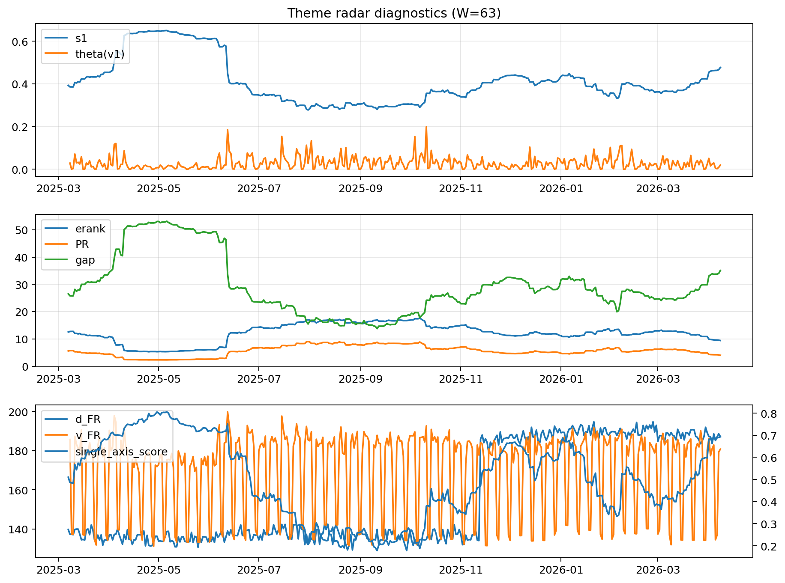

# Theme Radar Daily Brief — 2026-04-08

## Leaders (v1) — W=63
- **Nuclear_Uranium** (0.0779773855671169)
- Semis (0.0644054249800235)
- Genomics_Bio (0.0580543230750003)

## Challengers — W=63
**v2:** Rates (0.0904015547614741), Software_Cloud (0.0794189108310126), Crypto (0.065251977248245)
**v3:** Rates (0.1288836088773554), Metals (0.0653024910949879), Software_Cloud (0.0587641955035199)

## Migration (20D slope) — W=63
**Top risers:**
- axis_MegaCap_AI: 0.0005910313325921
- axis_Commodities: 0.0002904312512429
- axis_Sector_Comm: 0.0002663922057665
- axis_Sector_Health: 0.0001711592049401
- axis_USD: 0.0001445873940859
- axis_Rates: 0.0001240251837598
- axis_Credit: 9.743986852722985e-05
- axis_Cyber: 8.111960630619357e-05
- axis_Genomics_Bio: 7.500590749069452e-05
- axis_Sector_RealEstate: 5.762940692064267e-05

**Top fallers:**
- axis_Sector_Utilities: -0.0001014339924411
- axis_Grid_Power: -0.0001031255454922
- axis_Equity_US: -0.0001247136253439
- axis_Clean_Broad: -0.0001332704175528
- axis_Robotics: -0.000144211840922
- axis_Quantum: -0.0001565440426379
- axis_Crypto: -0.0002288794284369
- axis_Critical_Minerals: -0.000248286017361
- axis_Sector_Energy: -0.0002584754220239
- axis_Nuclear_Uranium: -0.0002997874524473

## Risk line (W=63)
- s1: 0.4766552902561397
- theta_v1: 0.0195493536785925
- v_FR: 180.8111298427946
- single_axis_score: 0.692964824120603

## Interpretation
**Regime:** `theme_migration`

- Action: Tomorrow watchlist: MegaCap_AI, Commodities, Sector_Comm, Sector_Health, USD + v2_top1=Rates
- Action: Hedge note: normal correlation stability.

- Percentiles (W=63 history): vfr_pct=0.49, theta_pct=0.49, s1_pct=0.83, score_pct=0.82.

---
**BUNDLE_ROOT_SHA256:** `a02fa7bb19812a103602b77e1731678f8c34b35deb9368c7644d642d55782dde`
