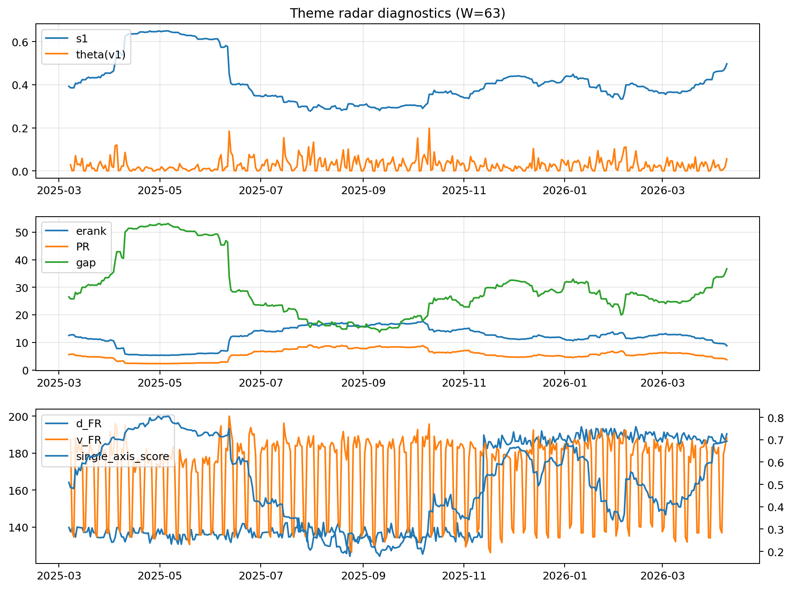

# Theme Radar Daily Brief — 2026-04-09

## Leaders (v1) — W=63
- **Nuclear_Uranium** (0.078154228680357)
- Semis (0.064395362902824)
- Genomics_Bio (0.0558391248902909)

## Challengers — W=63
**v2:** Software_Cloud (0.0890661408090722), Rates (0.0811958182305769), Crypto (0.0783577101526976)
**v3:** Rates (0.1364190328968068), Metals (0.0614816290114865), DataCenter_Infra (0.0593668407074331)

## Migration (20D slope) — W=63
**Top risers:**
- axis_MegaCap_AI: 0.0006436637257167
- axis_Commodities: 0.0003232488033649
- axis_Sector_Comm: 0.0002774349415484
- axis_Sector_Health: 0.0001959800690308
- axis_USD: 0.000131246857279
- axis_Sector_Fin: 8.640900182310926e-05
- axis_Cyber: 8.346903381226524e-05
- axis_Sector_ConsStap: 7.36638798802988e-05
- axis_Genomics_Bio: 6.981059468636139e-05
- axis_Sector_RealEstate: 6.745411039089155e-05

**Top fallers:**
- axis_Equity_ExUS: -0.0001002213568192
- axis_Equity_US: -0.0001167481597251
- axis_Clean_Broad: -0.000126005416889
- axis_Sector_Utilities: -0.0001333872228478
- axis_Robotics: -0.0001481894234232
- axis_Quantum: -0.0001708403077819
- axis_Crypto: -0.000211854147403
- axis_Sector_Energy: -0.0002216828186195
- axis_Nuclear_Uranium: -0.0002593393367549
- axis_Critical_Minerals: -0.0002612220762165

## Risk line (W=63)
- s1: 0.4967870228615994
- theta_v1: 0.0562457624192818
- v_FR: 188.2253761412244
- single_axis_score: 0.6932330827067669

## Interpretation
**Regime:** `theme_migration`

- Action: Tomorrow watchlist: MegaCap_AI, Commodities, Sector_Comm, Sector_Health, USD + v2_top1=Software_Cloud
- Action: Hedge note: normal correlation stability.

- Percentiles (W=63 history): vfr_pct=0.90, theta_pct=0.87, s1_pct=0.83, score_pct=0.82.

---
**BUNDLE_ROOT_SHA256:** `6cc526c7de88f71a665f1764bf2efbe1a48e33214472609137e408f57d2f2e80`
