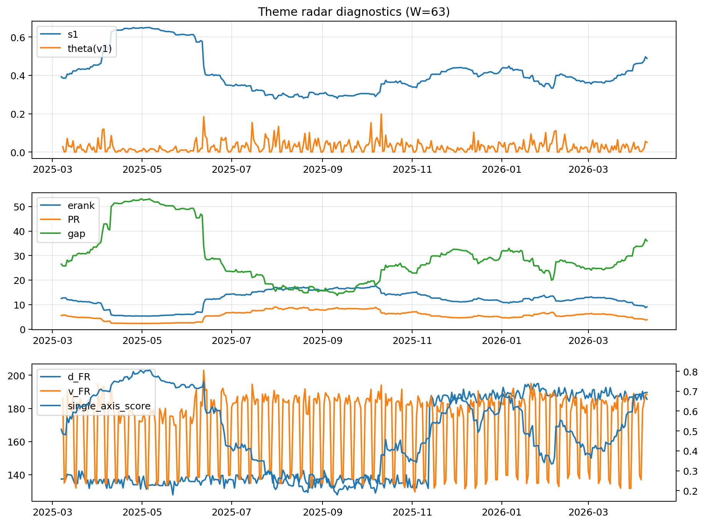

# Theme Radar Daily Brief — 2026-04-10

## Leaders (v1) — W=63
- **Nuclear_Uranium** (0.0774263831031088)
- Semis (0.0675377255265591)
- Genomics_Bio (0.0537584364358644)

## Challengers — W=63
**v2:** Software_Cloud (0.1038119476786857), Cyber (0.0691564624756505), Crypto (0.0650262588735007)
**v3:** Rates (0.1665509034779986), DataCenter_Infra (0.0757553243178909), MegaCap_AI (0.0565181669019736)

## Migration (20D slope) — W=63
**Top risers:**
- axis_MegaCap_AI: 0.000668526361448
- axis_Commodities: 0.0003773972038403
- axis_Sector_Comm: 0.0002905862466431
- axis_Sector_Health: 0.000222153938567
- axis_USD: 0.0001165699629471
- axis_Sector_Fin: 0.0001034856547752
- axis_Sector_ConsStap: 0.0001010302071189
- axis_Sector_RealEstate: 9.476411308296112e-05
- axis_Credit: 7.60688162776277e-05
- axis_Cyber: 5.840138952898638e-05

**Top fallers:**
- axis_Space: -9.878171190279484e-05
- axis_Equity_US: -0.0001192085268706
- axis_Clean_Broad: -0.0001251087220234
- axis_Sector_Utilities: -0.0001253566998198
- axis_Robotics: -0.0001498034995275
- axis_Sector_Energy: -0.000171218859469
- axis_Quantum: -0.000236411724586
- axis_Nuclear_Uranium: -0.0002648713937414
- axis_Crypto: -0.0002714690053191
- axis_Critical_Minerals: -0.000280320471031

## Risk line (W=63)
- s1: 0.4884148573694936
- theta_v1: 0.0503504931137571
- v_FR: 188.3928782678228
- single_axis_score: 0.6935

## Interpretation
**Regime:** `structure_rewrite`

- Action: Tomorrow watchlist: MegaCap_AI, Commodities, Sector_Comm, Sector_Health, USD + v2_top1=Software_Cloud
- Action: Hedge note: v_FR high + theta high → correlation structure unstable; diversify hedges / reduce reliance on static correlations.

- Percentiles (W=63 history): vfr_pct=0.90, theta_pct=0.84, s1_pct=0.82, score_pct=0.82.

---
**BUNDLE_ROOT_SHA256:** `75bc0740f2d9950d0ac4604de9b4555ad5e92848d411dc8f9b30d6698ec62151`
