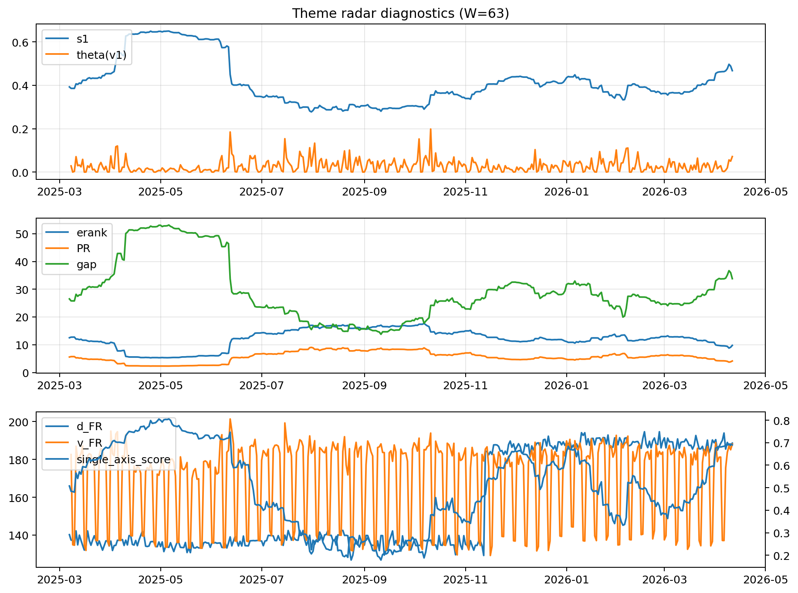

# Theme Radar Daily Brief — 2026-04-11

## Leaders (v1) — W=63
- **Nuclear_Uranium** (0.0773816294907643)
- Semis (0.0675527058996384)
- MegaCap_AI (0.0521439189407166)

## Challengers — W=63
**v2:** Software_Cloud (0.1083226636711967), Cyber (0.0706308094317626), Quantum (0.0624855552430462)
**v3:** Rates (0.1695855106902924), DataCenter_Infra (0.0913771851802315), Nuclear_Uranium (0.0554540913052152)

## Migration (20D slope) — W=63
**Top risers:**
- axis_MegaCap_AI: 0.0007720365895431
- axis_Commodities: 0.0004470038642999
- axis_Sector_Comm: 0.0003188461810502
- axis_Sector_Health: 0.0002341457648538
- axis_Sector_RealEstate: 0.0001140302142625
- axis_Sector_ConsStap: 0.0001133181887229
- axis_Sector_Fin: 0.0001130362973585
- axis_Credit: 0.0001032652176678
- axis_USD: 0.0001023514139654
- axis_Sector_Ind: 6.410933229634107e-05

**Top fallers:**
- axis_Clean_Broad: -0.0001124741362912
- axis_Sector_Utilities: -0.0001144910279839
- axis_Drones_Autonomy: -0.0001217023600314
- axis_Software_Cloud: -0.0001333931979996
- axis_Robotics: -0.0001415358249179
- axis_Space: -0.0001456455338967
- axis_Nuclear_Uranium: -0.0002640260663998
- axis_Critical_Minerals: -0.0002878476072825
- axis_Quantum: -0.0003183469573914
- axis_Crypto: -0.0003748831865694

## Risk line (W=63)
- s1: 0.4674139536228392
- theta_v1: 0.0716093062405578
- v_FR: 188.12854551726448
- single_axis_score: 0.6902743142144638

## Interpretation
**Regime:** `theme_migration`

- Action: Tomorrow watchlist: MegaCap_AI, Commodities, Sector_Comm, Sector_Health, Sector_RealEstate + v2_top1=Software_Cloud
- Action: Hedge note: normal correlation stability.

- Percentiles (W=63 history): vfr_pct=0.89, theta_pct=0.93, s1_pct=0.82, score_pct=0.82.

---
**BUNDLE_ROOT_SHA256:** `cdab16dbf7a002a12c27d8ed3a2105541b3b48a18af6d188e8a46d7bd2f1471f`
