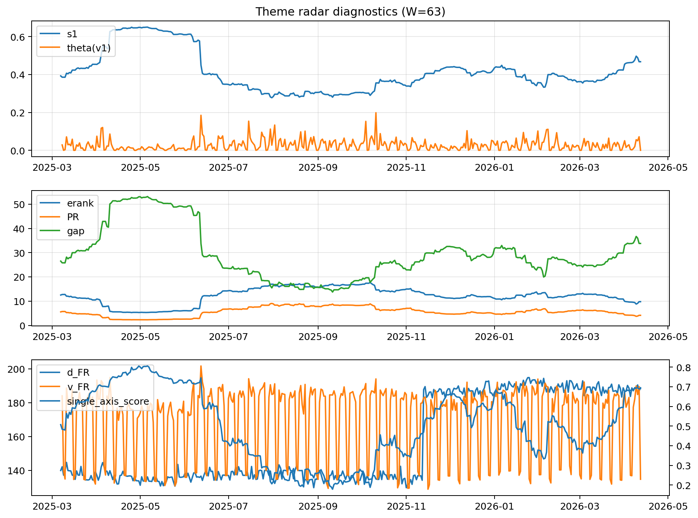

# Theme Radar Daily Brief — 2026-04-12

## Leaders (v1) — W=63
- **Nuclear_Uranium** (0.0773799212721094)
- Semis (0.0675490850636856)
- MegaCap_AI (0.052142866959046)

## Challengers — W=63
**v2:** Software_Cloud (0.1082966893064277), Cyber (0.0706135332927515), Quantum (0.0624724569787979)
**v3:** Rates (0.1695595725612112), DataCenter_Infra (0.091356938117272), Nuclear_Uranium (0.0554374390180008)

## Migration (20D slope) — W=63
**Top risers:**
- axis_MegaCap_AI: 0.0008517543273011
- axis_Commodities: 0.0004998186417819
- axis_Sector_Comm: 0.0003381248632537
- axis_Sector_Health: 0.0002411126705303
- axis_Sector_RealEstate: 0.0001306682242497
- axis_Credit: 0.0001247841840565
- axis_Sector_ConsStap: 0.0001219482245578
- axis_Sector_Fin: 0.0001204493946093
- axis_Rates: 0.0001067423894147
- axis_Semis: 9.339441639457153e-05

**Top fallers:**
- axis_Sector_Utilities: -0.0001015915583271
- axis_Robotics: -0.0001305157811425
- axis_Genomics_Bio: -0.0001552511069344
- axis_Drones_Autonomy: -0.0001875690450883
- axis_Space: -0.000189061723247
- axis_Software_Cloud: -0.0002246111960102
- axis_Nuclear_Uranium: -0.0002562268209072
- axis_Critical_Minerals: -0.0002903461080995
- axis_Quantum: -0.0003900217892937
- axis_Crypto: -0.0004593131439599

## Risk line (W=63)
- s1: 0.4674330858777562
- theta_v1: 0.000368677770691
- v_FR: 134.76676261073726
- single_axis_score: 0.690547263681592

## Interpretation
**Regime:** `theme_migration`

- Action: Tomorrow watchlist: MegaCap_AI, Commodities, Sector_Comm, Sector_Health, Sector_RealEstate + v2_top1=Software_Cloud
- Action: Hedge note: normal correlation stability.

- Percentiles (W=63 history): vfr_pct=0.12, theta_pct=0.12, s1_pct=0.82, score_pct=0.82.

---
**BUNDLE_ROOT_SHA256:** `0fa1ef924de0cfeaee1cffc7cab6ef518e99ae69438166826d6c4c9b05b6a1ac`
