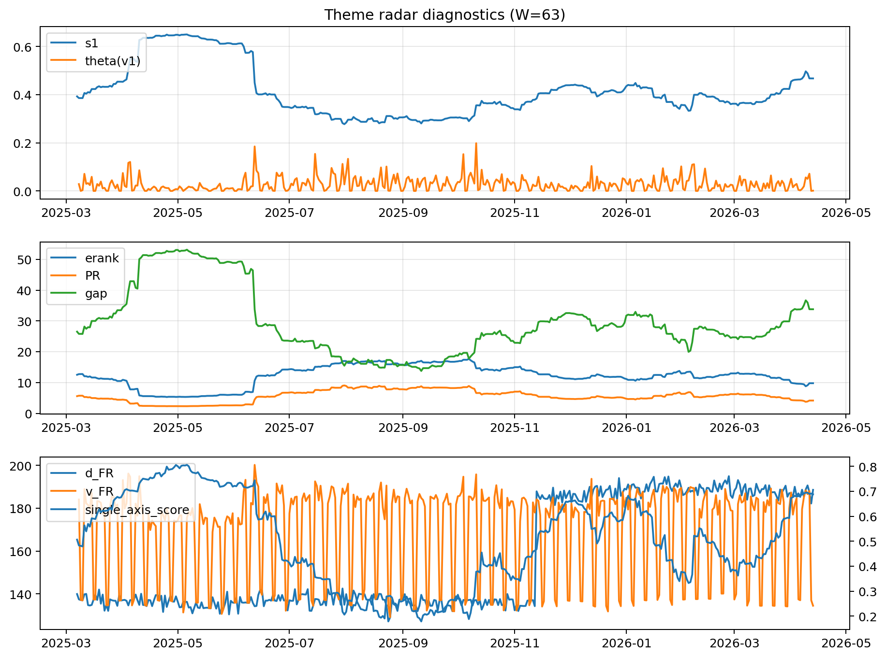

# Theme Radar Daily Brief — 2026-04-13

## Leaders (v1) — W=63
- **Nuclear_Uranium** (0.0773914994817198)
- Semis (0.0675662953595235)
- MegaCap_AI (0.0521485974216025)

## Challengers — W=63
**v2:** Software_Cloud (0.1083826824129498), Cyber (0.0706740754079082), Quantum (0.0625225975453695)
**v3:** Rates (0.1696394202947699), DataCenter_Infra (0.0914248548623032), Nuclear_Uranium (0.0554952455509674)

## Migration (20D slope) — W=63
**Top risers:**
- axis_MegaCap_AI: 0.0009177306161071
- axis_Commodities: 0.0005422996090642
- axis_Sector_Comm: 0.000352501959852
- axis_Sector_Health: 0.0002408300474064
- axis_Rates: 0.0001688924921443
- axis_Credit: 0.0001526002462211
- axis_Sector_RealEstate: 0.0001476133357259
- axis_Sector_ConsStap: 0.0001300051016289
- axis_Sector_Fin: 0.0001293510507618
- axis_Semis: 0.0001281395085735

**Top fallers:**
- axis_Miners: -0.0001079480120993
- axis_Robotics: -0.0001192567941032
- axis_Genomics_Bio: -0.0002314802743825
- axis_Space: -0.0002321375126731
- axis_Drones_Autonomy: -0.0002484870069894
- axis_Nuclear_Uranium: -0.0002520278333021
- axis_Critical_Minerals: -0.0002881071405253
- axis_Software_Cloud: -0.0002926530755812
- axis_Quantum: -0.000451624235862
- axis_Crypto: -0.0005308257869901

## Risk line (W=63)
- s1: 0.4673266516120147
- theta_v1: 0.0012346386985922
- v_FR: 134.47411980301507
- single_axis_score: 0.6878411910669975

## Interpretation
**Regime:** `theme_migration`

- Action: Tomorrow watchlist: MegaCap_AI, Commodities, Sector_Comm, Sector_Health, Rates + v2_top1=Software_Cloud
- Action: Hedge note: normal correlation stability.

- Percentiles (W=63 history): vfr_pct=0.08, theta_pct=0.22, s1_pct=0.82, score_pct=0.81.

---
**BUNDLE_ROOT_SHA256:** `1ffea4c1f370eebdcbfc37cdd1d36eca50c4c6660a84f8f4dbcf2ff8e28ed8a5`
