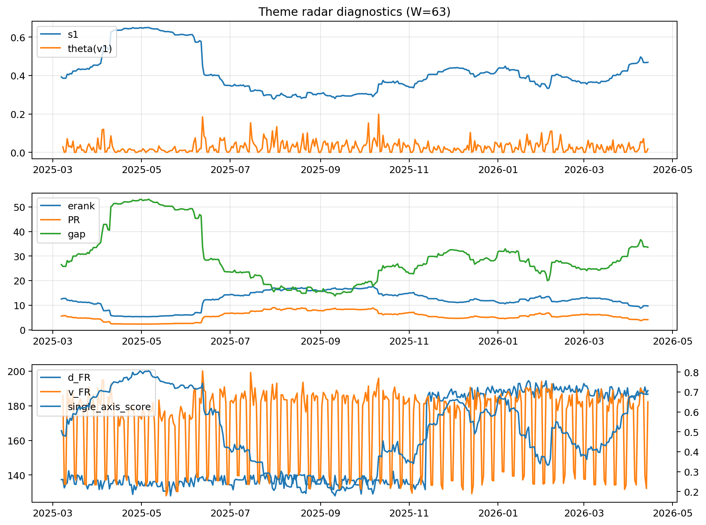

# Theme Radar Daily Brief — 2026-04-14

## Leaders (v1) — W=63
- **Nuclear_Uranium** (0.0771230004156513)
- Semis (0.0671309334640289)
- MegaCap_AI (0.052434044098287)

## Challengers — W=63
**v2:** Software_Cloud (0.1071705316685247), Cyber (0.0695957671399687), Crypto (0.0602325964473845)
**v3:** Rates (0.1730243515286604), DataCenter_Infra (0.0956595270429667), Nuclear_Uranium (0.0571226550645848)

## Migration (20D slope) — W=63
**Top risers:**
- axis_MegaCap_AI: 0.000930900634299
- axis_Commodities: 0.0005600671925787
- axis_Sector_Comm: 0.0003491455649346
- axis_Sector_Health: 0.000244631360374
- axis_Rates: 0.000207364205678
- axis_Credit: 0.0001715170905343
- axis_Sector_RealEstate: 0.0001532421660646
- axis_Sector_Energy: 0.0001383214664027
- axis_Semis: 0.0001379030597859
- axis_Sector_ConsStap: 0.0001356583363576

**Top fallers:**
- axis_Robotics: -0.0001049390832969
- axis_Cyber: -0.0001258800084358
- axis_Nuclear_Uranium: -0.0002269053637997
- axis_Critical_Minerals: -0.0002534612454188
- axis_Genomics_Bio: -0.0002603664427364
- axis_Space: -0.0002763350108566
- axis_Drones_Autonomy: -0.0003118267707151
- axis_Software_Cloud: -0.0003557424411878
- axis_Quantum: -0.0004890815424067
- axis_Crypto: -0.0005853592776335

## Risk line (W=63)
- s1: 0.4686099482473949
- theta_v1: 0.0181007169712397
- v_FR: 182.25499386246483
- single_axis_score: 0.6886138613861387

## Interpretation
**Regime:** `theme_migration`

- Action: Tomorrow watchlist: MegaCap_AI, Commodities, Sector_Comm, Sector_Health, Rates + v2_top1=Software_Cloud
- Action: Hedge note: normal correlation stability.

- Percentiles (W=63 history): vfr_pct=0.58, theta_pct=0.46, s1_pct=0.82, score_pct=0.81.

---
**BUNDLE_ROOT_SHA256:** `dc3fbb782b501ed64511e8f26268a2691db8bca32ae3cc7b38e61307dd319aa2`
