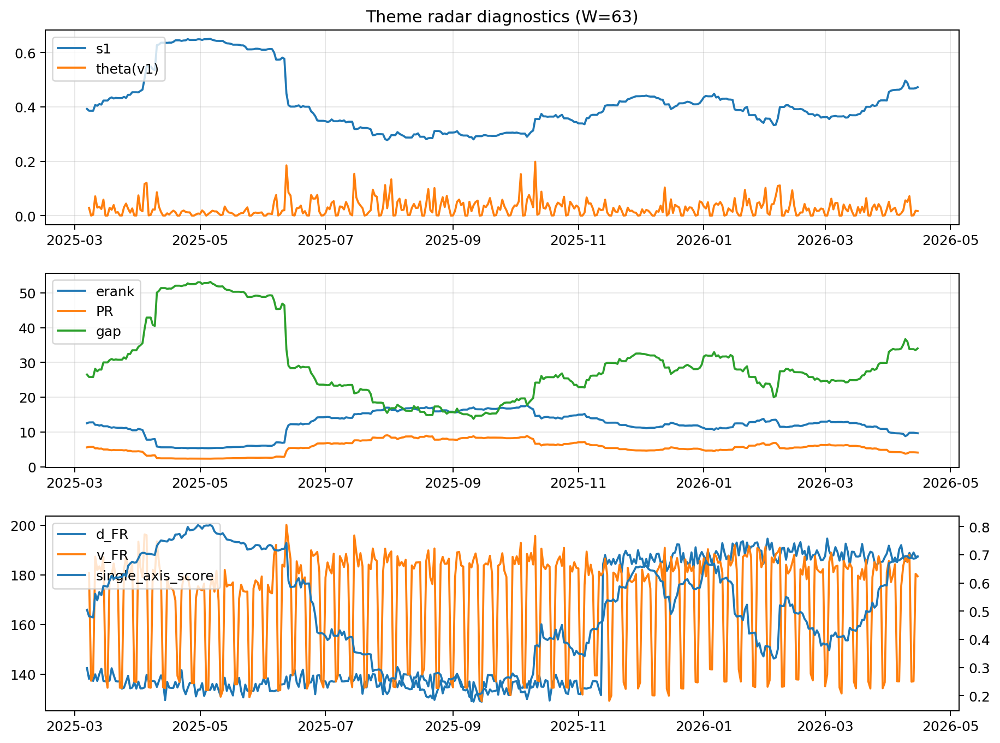

# Theme Radar Daily Brief — 2026-04-15

## Leaders (v1) — W=63
- **Nuclear_Uranium** (0.076876894165018)
- Semis (0.0667823127675947)
- MegaCap_AI (0.05276672633138)

## Challengers — W=63
**v2:** Software_Cloud (0.1077848211276257), Cyber (0.0695980745667537), Nuclear_Uranium (0.0598962671269525)
**v3:** Rates (0.1762109565323553), DataCenter_Infra (0.0988076628233928), Semis (0.0551416631950898)

## Migration (20D slope) — W=63
**Top risers:**
- axis_MegaCap_AI: 0.0009260443179377
- axis_Commodities: 0.0005779347732685
- axis_Sector_Comm: 0.0003349392563917
- axis_Rates: 0.0002691168697964
- axis_Sector_Health: 0.0002407899678881
- axis_Sector_Energy: 0.0002044181473244
- axis_Credit: 0.0001848608849765
- axis_Sector_RealEstate: 0.0001610871123055
- axis_Sector_ConsStap: 0.0001403379672716
- axis_Semis: 0.0001345656740151

**Top fallers:**
- axis_DataCenter_Infra: -0.0001301552237309
- axis_Cyber: -0.0001653377409923
- axis_Nuclear_Uranium: -0.0002104998314078
- axis_Critical_Minerals: -0.0002203367761967
- axis_Genomics_Bio: -0.0002946873617235
- axis_Space: -0.0002971815415179
- axis_Drones_Autonomy: -0.000353559239588
- axis_Software_Cloud: -0.0004088164276587
- axis_Quantum: -0.0005094189794001
- axis_Crypto: -0.000634468079894

## Risk line (W=63)
- s1: 0.472475930490193
- theta_v1: 0.0168188934218176
- v_FR: 179.46267190592283
- single_axis_score: 0.6933333333333332

## Interpretation
**Regime:** `theme_migration`

- Action: Tomorrow watchlist: MegaCap_AI, Commodities, Sector_Comm, Rates, Sector_Health + v2_top1=Software_Cloud
- Action: Hedge note: normal correlation stability.

- Percentiles (W=63 history): vfr_pct=0.45, theta_pct=0.45, s1_pct=0.82, score_pct=0.82.

---
**BUNDLE_ROOT_SHA256:** `4d4cbf05883094d6896333eafc9cd25d2be259e8c138e3014ca8f273913b8640`
