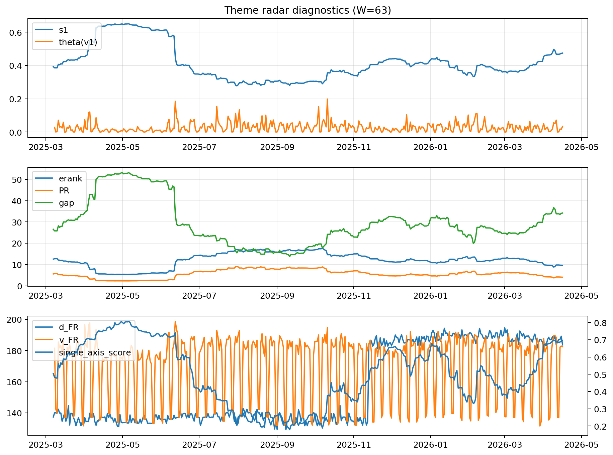

# Theme Radar Daily Brief — 2026-04-16

## Leaders (v1) — W=63
- **Nuclear_Uranium** (0.0761599020394275)
- Semis (0.0668709822663487)
- MegaCap_AI (0.0526759750127876)

## Challengers — W=63
**v2:** Software_Cloud (0.1055097327798735), Cyber (0.0696043007473942), Quantum (0.0692620057333015)
**v3:** Rates (0.1603027166784288), DataCenter_Infra (0.0873951473167353), Semis (0.0625858337399503)

## Migration (20D slope) — W=63
**Top risers:**
- axis_MegaCap_AI: 0.0009049783188542
- axis_Commodities: 0.0005853837554324
- axis_Rates: 0.0003905806451333
- axis_Sector_Comm: 0.0003259614910392
- axis_Sector_Energy: 0.0002548720068545
- axis_Sector_Health: 0.0002252850114953
- axis_Credit: 0.0002048570706765
- axis_Sector_RealEstate: 0.0001631441361826
- axis_Sector_ConsStap: 0.0001481709190902
- axis_Semis: 0.0001437783288837

**Top fallers:**
- axis_DataCenter_Infra: -9.490343075751158e-05
- axis_Critical_Minerals: -0.0001846509677892
- axis_Nuclear_Uranium: -0.0002037570709227
- axis_Cyber: -0.0002217817869699
- axis_Space: -0.0002950913101054
- axis_Drones_Autonomy: -0.0003787015099588
- axis_Genomics_Bio: -0.0003846691077723
- axis_Software_Cloud: -0.0004807861724871
- axis_Quantum: -0.0005655314563594
- axis_Crypto: -0.0006683788578433

## Risk line (W=63)
- s1: 0.4741668195819726
- theta_v1: 0.0336616008100446
- v_FR: 182.47297516622083
- single_axis_score: 0.6940886699507389

## Interpretation
**Regime:** `theme_migration`

- Action: Tomorrow watchlist: MegaCap_AI, Commodities, Rates, Sector_Comm, Sector_Energy + v2_top1=Software_Cloud
- Action: Hedge note: normal correlation stability.

- Percentiles (W=63 history): vfr_pct=0.61, theta_pct=0.70, s1_pct=0.82, score_pct=0.82.

---
**BUNDLE_ROOT_SHA256:** `8b6324953dc6a496cf434a85d6e6aef649b1e803ae1e040c214fac7dee811b27`
