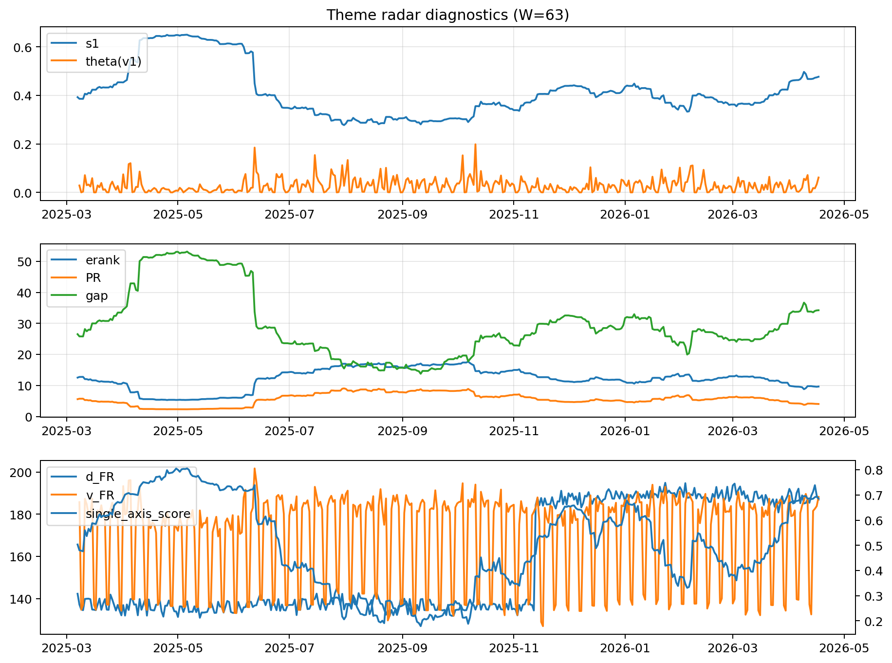

# Theme Radar Daily Brief — 2026-04-17

## Leaders (v1) — W=63
- **Nuclear_Uranium** (0.0745405531023408)
- Semis (0.0650991191640866)
- Genomics_Bio (0.0517422938112585)

## Challengers — W=63
**v2:** Software_Cloud (0.1107002212672292), Cyber (0.0729398669746677), Quantum (0.070492603328136)
**v3:** Rates (0.1714541650452853), Semis (0.0828613576121336), Metals (0.0555193053315091)

## Migration (20D slope) — W=63
**Top risers:**
- axis_MegaCap_AI: 0.0008692681095073
- axis_Commodities: 0.0006136578201861
- axis_Rates: 0.0005402356120447
- axis_Sector_Comm: 0.000309539078272
- axis_Sector_Energy: 0.0003003911682222
- axis_Credit: 0.0002274558456287
- axis_Sector_Health: 0.0002092489730021
- axis_Sector_RealEstate: 0.0001648095372484
- axis_Sector_ConsStap: 0.0001561502752395
- axis_Semis: 0.0001229919442797

**Top fallers:**
- axis_Clean_Wind: -9.441692695335916e-05
- axis_Critical_Minerals: -0.000182327407903
- axis_Nuclear_Uranium: -0.0002294611528842
- axis_Cyber: -0.0002735575149781
- axis_Space: -0.0002745881056018
- axis_Drones_Autonomy: -0.0003945180344181
- axis_Genomics_Bio: -0.0004371947407017
- axis_Software_Cloud: -0.000541011760344
- axis_Quantum: -0.000615499800273
- axis_Crypto: -0.0006945123388025

## Risk line (W=63)
- s1: 0.4767026245406893
- theta_v1: 0.061498403898689
- v_FR: 188.2254283860125
- single_axis_score: 0.6864864864864864

## Interpretation
**Regime:** `theme_migration`

- Action: Tomorrow watchlist: MegaCap_AI, Commodities, Rates, Sector_Comm, Sector_Energy + v2_top1=Software_Cloud
- Action: Hedge note: normal correlation stability.

- Percentiles (W=63 history): vfr_pct=0.90, theta_pct=0.89, s1_pct=0.83, score_pct=0.81.

---
**BUNDLE_ROOT_SHA256:** `22cca0746976426c9c28c521984d2cb31d256fb9ada7f86d0668b7185ac348fb`
