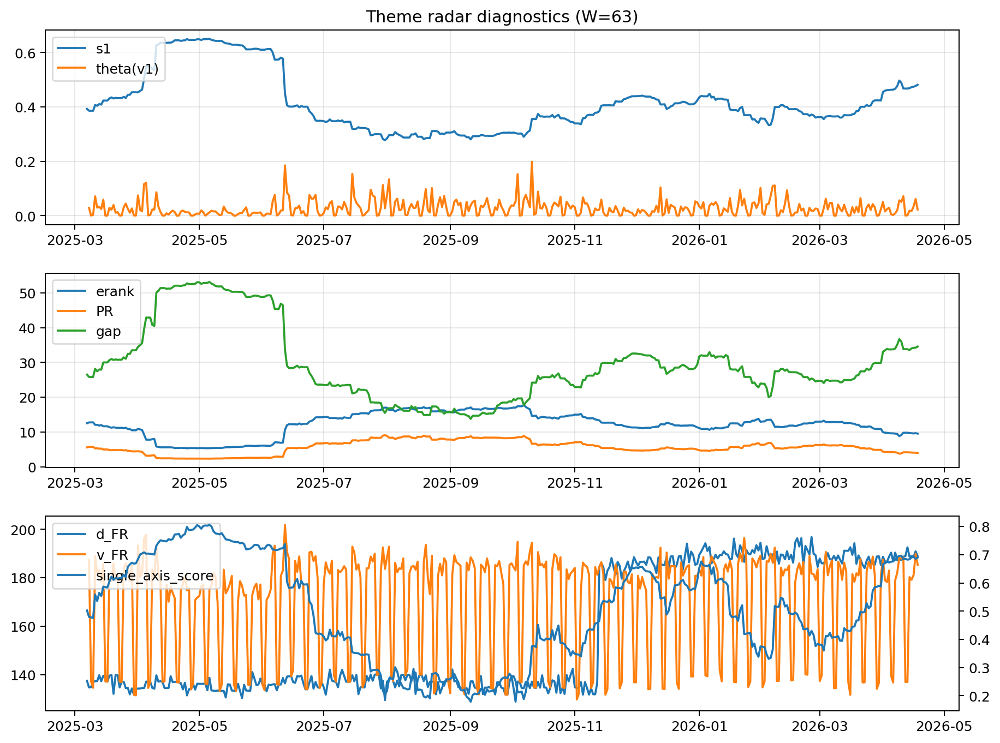

# Theme Radar Daily Brief — 2026-04-18

## Leaders (v1) — W=63
- **Nuclear_Uranium** (0.0745358037298741)
- Semis (0.0656784850889395)
- MegaCap_AI (0.0533837883013333)

## Challengers — W=63
**v2:** Software_Cloud (0.1100006933009984), Cyber (0.072357969974624), Quantum (0.0700486571294787)
**v3:** Rates (0.1772685618555932), Semis (0.0747820646375178), Nuclear_Uranium (0.0604082971942066)

## Migration (20D slope) — W=63
**Top risers:**
- axis_MegaCap_AI: 0.000838026453755
- axis_Rates: 0.0006867668454865
- axis_Commodities: 0.0006335528613314
- axis_Sector_Energy: 0.0003476784175478
- axis_Sector_Comm: 0.0002843500145866
- axis_Credit: 0.0002457815473182
- axis_Sector_Health: 0.0001889014831395
- axis_DataCenter_Infra: 0.0001655444863583
- axis_Sector_ConsStap: 0.0001647631303483
- axis_Sector_RealEstate: 0.0001641776937671

**Top fallers:**
- axis_Metals: -0.0001110230301641
- axis_Critical_Minerals: -0.0001838486790263
- axis_Nuclear_Uranium: -0.0002467385052552
- axis_Space: -0.0002719288255963
- axis_Cyber: -0.0003230109695072
- axis_Drones_Autonomy: -0.0004217716150809
- axis_Genomics_Bio: -0.0004753146693811
- axis_Software_Cloud: -0.0005970081247519
- axis_Quantum: -0.000655180711731
- axis_Crypto: -0.0006963801988234

## Risk line (W=63)
- s1: 0.4812367488266161
- theta_v1: 0.0223654785452855
- v_FR: 185.2983175918781
- single_axis_score: 0.6897058823529412

## Interpretation
**Regime:** `theme_migration`

- Action: Tomorrow watchlist: MegaCap_AI, Rates, Commodities, Sector_Energy, Sector_Comm + v2_top1=Software_Cloud
- Action: Hedge note: normal correlation stability.

- Percentiles (W=63 history): vfr_pct=0.75, theta_pct=0.54, s1_pct=0.83, score_pct=0.81.

---
**BUNDLE_ROOT_SHA256:** `556a2de0021caeb7972653c29376320297172d0bb49c1afcabfd724e87ef103a`
