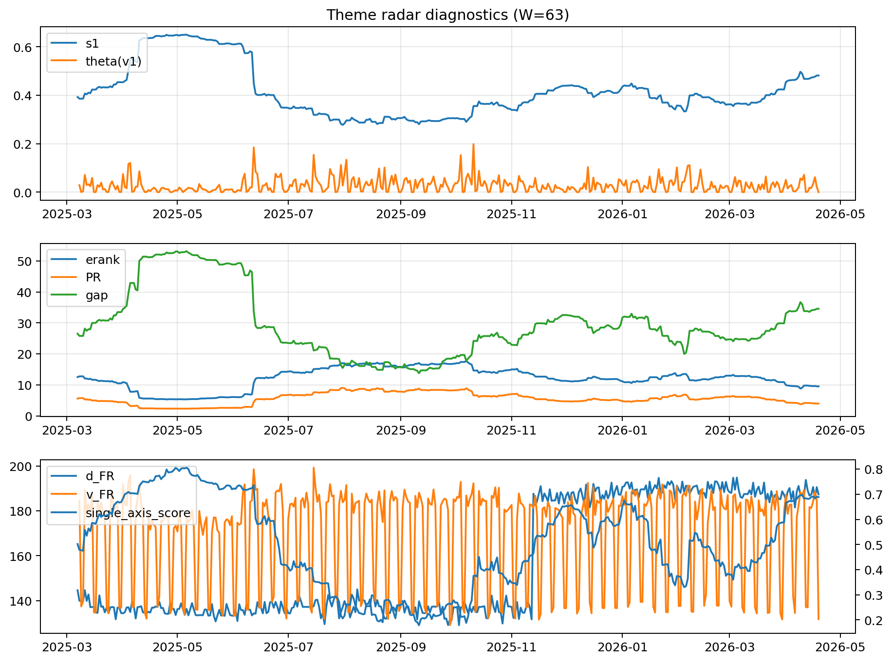

# Theme Radar Daily Brief — 2026-04-19

## Leaders (v1) — W=63
- **Nuclear_Uranium** (0.0745363527364514)
- Semis (0.0656811710336702)
- MegaCap_AI (0.0533869504130094)

## Challengers — W=63
**v2:** Software_Cloud (0.1099841306470358), Cyber (0.0723442203998193), Quantum (0.0700531491335656)
**v3:** Rates (0.1772282739285393), Semis (0.0747819965931464), Nuclear_Uranium (0.0604039904835655)

## Migration (20D slope) — W=63
**Top risers:**
- axis_Rates: 0.0008182228339206
- axis_MegaCap_AI: 0.0007828853575432
- axis_Commodities: 0.0006370299128266
- axis_Sector_Energy: 0.0003869106712256
- axis_DataCenter_Infra: 0.0002800523403701
- axis_Credit: 0.000258549574989
- axis_Sector_Comm: 0.0002516218908873
- axis_Sector_ConsStap: 0.0001692548482255
- axis_Sector_Health: 0.000162714404107
- axis_Sector_RealEstate: 0.0001591146693396

**Top fallers:**
- axis_Metals: -0.0001361640744015
- axis_Critical_Minerals: -0.0001771384481351
- axis_Nuclear_Uranium: -0.0002557081003811
- axis_Space: -0.000262434730493
- axis_Cyber: -0.0003660642851731
- axis_Drones_Autonomy: -0.0004381737127984
- axis_Genomics_Bio: -0.0005067740309569
- axis_Software_Cloud: -0.000641022822419
- axis_Quantum: -0.0006765843779733
- axis_Crypto: -0.0006802857455054

## Risk line (W=63)
- s1: 0.4812253300657675
- theta_v1: 0.0001480311339369
- v_FR: 131.75631802309732
- single_axis_score: 0.6885085574572127

## Interpretation
**Regime:** `theme_migration`

- Action: Tomorrow watchlist: Rates, MegaCap_AI, Commodities, Sector_Energy, DataCenter_Infra + v2_top1=Software_Cloud
- Action: Hedge note: normal correlation stability.

- Percentiles (W=63 history): vfr_pct=0.01, theta_pct=0.08, s1_pct=0.82, score_pct=0.81.

---
**BUNDLE_ROOT_SHA256:** `e11e73ac635284e281254c4c8a238f1b8bebbed232e6db5b0461a6599c7614a2`
