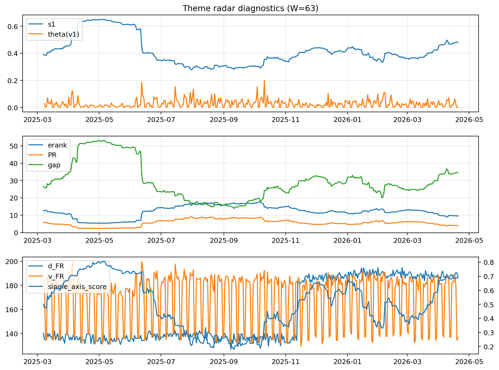

# Theme Radar Daily Brief — 2026-04-20

## Leaders (v1) — W=63
- **Nuclear_Uranium** (0.0745312225892643)
- Semis (0.0656770509970556)
- MegaCap_AI (0.0533843568140165)

## Challengers — W=63
**v2:** Software_Cloud (0.1099736389694397), Cyber (0.0723354303914502), Quantum (0.0700317000712924)
**v3:** Rates (0.1772022563524155), Semis (0.0747931830483957), Nuclear_Uranium (0.0603762315503981)

## Migration (20D slope) — W=63
**Top risers:**
- axis_Rates: 0.0008777803854785
- axis_MegaCap_AI: 0.0007067276051719
- axis_Commodities: 0.000625409791843
- axis_Sector_Energy: 0.0004232395891973
- axis_DataCenter_Infra: 0.0003836959208945
- axis_Credit: 0.0002486148270429
- axis_Sector_Comm: 0.0002053317468778
- axis_Sector_ConsStap: 0.0001680703117414
- axis_Sector_RealEstate: 0.0001454134685003
- axis_Sector_Health: 0.000127139233408

**Top fallers:**
- axis_Critical_Minerals: -0.0001617903513108
- axis_Metals: -0.0001628320449299
- axis_Space: -0.0002248840296894
- axis_Nuclear_Uranium: -0.0002402105944886
- axis_Cyber: -0.0004033850358848
- axis_Drones_Autonomy: -0.0004393957585233
- axis_Genomics_Bio: -0.0005224887472983
- axis_Crypto: -0.0006464879685824
- axis_Quantum: -0.000661795670532
- axis_Software_Cloud: -0.0006728328650959

## Risk line (W=63)
- s1: 0.4812630806949117
- theta_v1: 0.0009953500508012
- v_FR: 136.78215272635242
- single_axis_score: 0.6902439024390243

## Interpretation
**Regime:** `theme_migration`

- Action: Tomorrow watchlist: Rates, MegaCap_AI, Commodities, Sector_Energy, DataCenter_Infra + v2_top1=Software_Cloud
- Action: Hedge note: normal correlation stability.

- Percentiles (W=63 history): vfr_pct=0.15, theta_pct=0.20, s1_pct=0.83, score_pct=0.82.

---
**BUNDLE_ROOT_SHA256:** `fa3f37d4cc4bed8f041dd54e09737a50a3bf43fb5bd519a362bdf80550eb7645`
