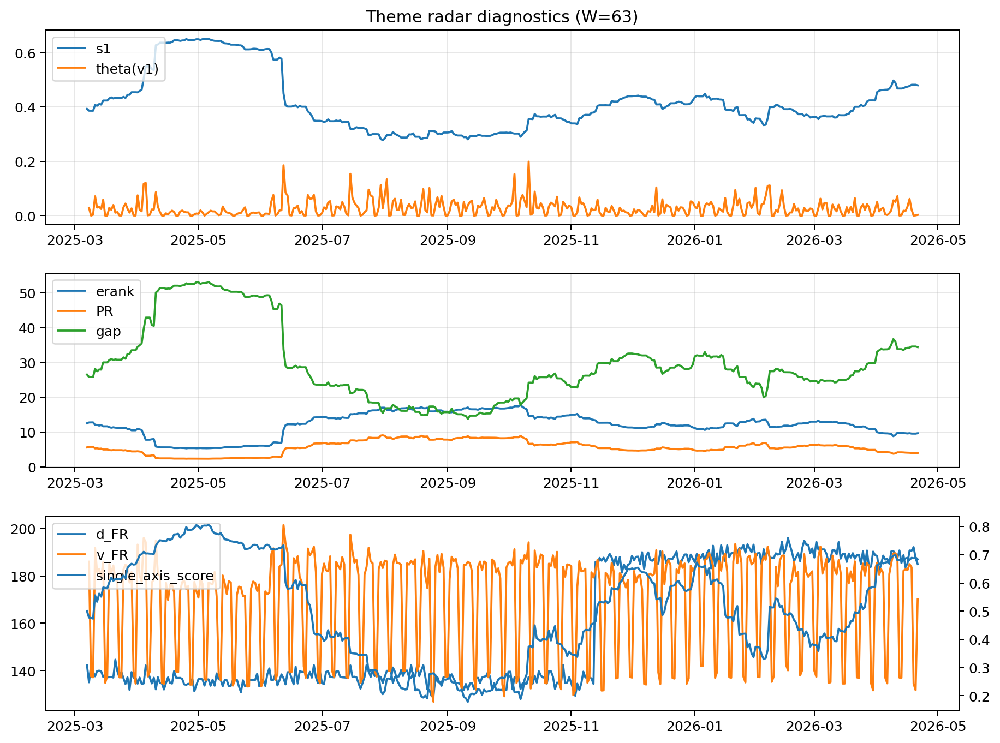

# Theme Radar Daily Brief — 2026-04-21

## Leaders (v1) — W=63
- **Nuclear_Uranium** (0.0744131593497853)
- Semis (0.0657108953194672)
- MegaCap_AI (0.0532796329464818)

## Challengers — W=63
**v2:** Software_Cloud (0.1099713419005481), Cyber (0.072355793112194), Metals (0.0700602373107928)
**v3:** Rates (0.1767967168739886), Semis (0.0739723979406765), Nuclear_Uranium (0.061164577295198)

## Migration (20D slope) — W=63
**Top risers:**
- axis_Rates: 0.0009165564891506
- axis_MegaCap_AI: 0.0006678051595181
- axis_Commodities: 0.0006142767637066
- axis_DataCenter_Infra: 0.0004803323855321
- axis_Sector_Energy: 0.0004251671523614
- axis_Credit: 0.0002484742067069
- axis_Sector_Comm: 0.0001783950211821
- axis_Sector_ConsStap: 0.0001572321974867
- axis_Sector_RealEstate: 0.0001367586472432
- axis_Sector_Health: 0.0001144583503255

**Top fallers:**
- axis_Critical_Minerals: -0.0001715486154557
- axis_Metals: -0.0001875969972453
- axis_Space: -0.000194861154216
- axis_Nuclear_Uranium: -0.0002578763914797
- axis_Cyber: -0.0004087233061531
- axis_Drones_Autonomy: -0.0004329902850859
- axis_Genomics_Bio: -0.0005014807401547
- axis_Crypto: -0.000631715250976
- axis_Quantum: -0.0006485916473289
- axis_Software_Cloud: -0.0006651956589377

## Risk line (W=63)
- s1: 0.4792270925550339
- theta_v1: 0.0027382912321709
- v_FR: 170.06562899049914
- single_axis_score: 0.683698296836983

## Interpretation
**Regime:** `theme_migration`

- Action: Tomorrow watchlist: Rates, MegaCap_AI, Commodities, DataCenter_Infra, Sector_Energy + v2_top1=Software_Cloud
- Action: Hedge note: normal correlation stability.

- Percentiles (W=63 history): vfr_pct=0.29, theta_pct=0.26, s1_pct=0.82, score_pct=0.81.

---
**BUNDLE_ROOT_SHA256:** `d85663bb7d8f750ba715f37805f7dfdea423c17c818bce7f4ac492fe8b7520b8`
