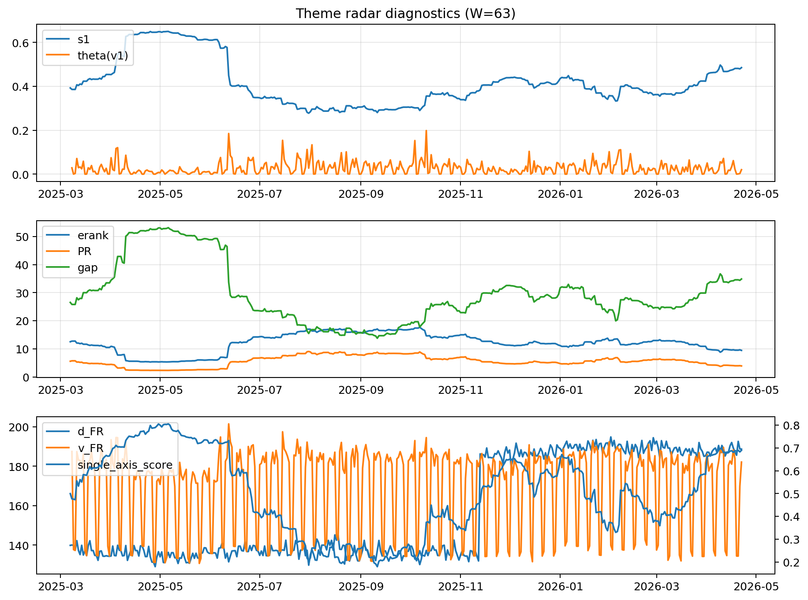

# Theme Radar Daily Brief — 2026-04-22

## Leaders (v1) — W=63
- **Nuclear_Uranium** (0.0747836471628871)
- Semis (0.0644197511667831)
- MegaCap_AI (0.0532668900296679)

## Challengers — W=63
**v2:** Software_Cloud (0.1121514793993903), Cyber (0.0743466639262667), Metals (0.0714137654616814)
**v3:** Rates (0.1757611516956751), Semis (0.0833532363597569), Nuclear_Uranium (0.0546021677237214)

## Migration (20D slope) — W=63
**Top risers:**
- axis_Rates: 0.0009409195221063
- axis_MegaCap_AI: 0.0006132142144652
- axis_Commodities: 0.0005987207655116
- axis_DataCenter_Infra: 0.0005661655826784
- axis_Sector_Energy: 0.0004315600685796
- axis_Credit: 0.0002425805472605
- axis_Sector_Comm: 0.0001463172293302
- axis_Sector_ConsStap: 0.0001433628914966
- axis_Sector_RealEstate: 0.0001302365772889
- axis_Sector_Health: 0.0001022162516253

**Top fallers:**
- axis_Space: -0.0001649177072126
- axis_Critical_Minerals: -0.0001809968091669
- axis_Metals: -0.0001923164568975
- axis_Nuclear_Uranium: -0.0002519490600036
- axis_Cyber: -0.0004166467831773
- axis_Drones_Autonomy: -0.0004285295434688
- axis_Genomics_Bio: -0.0004541116185641
- axis_Crypto: -0.0006131387833061
- axis_Quantum: -0.0006327546350346
- axis_Software_Cloud: -0.0006542624421639

## Risk line (W=63)
- s1: 0.4850067959517564
- theta_v1: 0.0202474851563078
- v_FR: 182.09569953611935
- single_axis_score: 0.6898058252427184

## Interpretation
**Regime:** `theme_migration`

- Action: Tomorrow watchlist: Rates, MegaCap_AI, Commodities, DataCenter_Infra, Sector_Energy + v2_top1=Software_Cloud
- Action: Hedge note: normal correlation stability.

- Percentiles (W=63 history): vfr_pct=0.57, theta_pct=0.51, s1_pct=0.83, score_pct=0.82.

---
**BUNDLE_ROOT_SHA256:** `8d182e40f109137ff0c94d85c09eb564e96ec473bb901565e4224f8a7afbb564`
