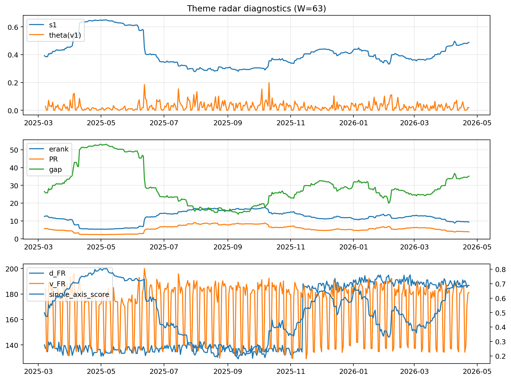

# Theme Radar Daily Brief — 2026-04-23

## Leaders (v1) — W=63
- **Nuclear_Uranium** (0.0740549052878419)
- Semis (0.0642323292763305)
- MegaCap_AI (0.0536054129079334)

## Challengers — W=63
**v2:** Software_Cloud (0.1125417901348681), Cyber (0.0748679112094152), Metals (0.0735335756317617)
**v3:** Rates (0.1707229413899043), Semis (0.0862177703054048), Genomics_Bio (0.0500659963709098)

## Migration (20D slope) — W=63
**Top risers:**
- axis_Rates: 0.0009517315097045
- axis_DataCenter_Infra: 0.0006627277091446
- axis_MegaCap_AI: 0.0005767139897174
- axis_Commodities: 0.0005538179781105
- axis_Sector_Energy: 0.0004246475810116
- axis_Credit: 0.0002283640854561
- axis_Sector_Comm: 0.000128107024564
- axis_Sector_ConsStap: 0.000124428437111
- axis_Sector_RealEstate: 0.0001216204413908
- axis_Sector_Health: 8.457089134822818e-05

**Top fallers:**
- axis_Space: -0.0001594147716615
- axis_Critical_Minerals: -0.000184014115587
- axis_Metals: -0.0001920623860483
- axis_Nuclear_Uranium: -0.0002512739655393
- axis_Genomics_Bio: -0.0003948145713544
- axis_Cyber: -0.0004105734584174
- axis_Drones_Autonomy: -0.0004159044904504
- axis_Crypto: -0.0005739978058516
- axis_Quantum: -0.0006066867856274
- axis_Software_Cloud: -0.0006172225347038

## Risk line (W=63)
- s1: 0.4879092825975997
- theta_v1: 0.0181065832985963
- v_FR: 181.2015691245676
- single_axis_score: 0.6871670702179176

## Interpretation
**Regime:** `theme_migration`

- Action: Tomorrow watchlist: Rates, DataCenter_Infra, MegaCap_AI, Commodities, Sector_Energy + v2_top1=Software_Cloud
- Action: Hedge note: normal correlation stability.

- Percentiles (W=63 history): vfr_pct=0.54, theta_pct=0.47, s1_pct=0.83, score_pct=0.81.

---
**BUNDLE_ROOT_SHA256:** `3f02c0d45b8671715e1f2eb68c42b4fbc752929961f3613910220e62367acaa1`
