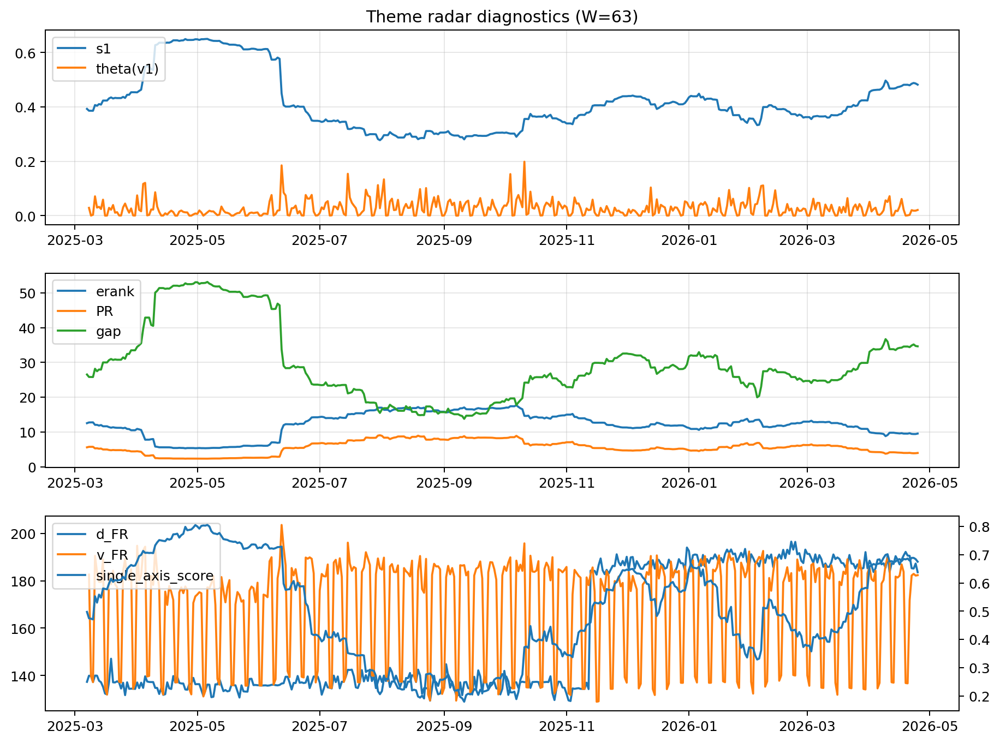

# Theme Radar Daily Brief — 2026-04-25

## Leaders (v1) — W=63
- **Nuclear_Uranium** (0.0740606722064164)
- Semis (0.0628780096058365)
- MegaCap_AI (0.0537538330403257)

## Challengers — W=63
**v2:** Software_Cloud (0.1124868437530611), Cyber (0.0740148061897809), Quantum (0.067246880422384)
**v3:** Rates (0.168109080030205), Semis (0.0804021480998205), Metals (0.0537806008981956)

## Migration (20D slope) — W=63
**Top risers:**
- axis_Rates: 0.0009153718240793
- axis_DataCenter_Infra: 0.0007624040568639
- axis_MegaCap_AI: 0.0004843336053992
- axis_Commodities: 0.0004749026372403
- axis_Sector_Energy: 0.000373199700015
- axis_Credit: 0.0002051204566227
- axis_Sector_ConsStap: 9.65138886724867e-05
- axis_Sector_Comm: 9.462742678634322e-05
- axis_Sector_RealEstate: 9.17475772824156e-05
- axis_Sector_Health: 5.974541797696258e-05

**Top fallers:**
- axis_Metals: -0.00012839461447
- axis_Space: -0.0001542253489528
- axis_Critical_Minerals: -0.0001788792274206
- axis_Nuclear_Uranium: -0.0002670120910836
- axis_Genomics_Bio: -0.000301837623345
- axis_Cyber: -0.0003519427177346
- axis_Drones_Autonomy: -0.0003531779356582
- axis_Crypto: -0.0004151712732559
- axis_Software_Cloud: -0.0005055203626923
- axis_Quantum: -0.000528812607351

## Risk line (W=63)
- s1: 0.481690357980991
- theta_v1: 0.0209346037661897
- v_FR: 182.334089299932
- single_axis_score: 0.6751807228915662

## Interpretation
**Regime:** `theme_migration`

- Action: Tomorrow watchlist: Rates, DataCenter_Infra, MegaCap_AI, Commodities, Sector_Energy + v2_top1=Software_Cloud
- Action: Hedge note: normal correlation stability.

- Percentiles (W=63 history): vfr_pct=0.58, theta_pct=0.52, s1_pct=0.82, score_pct=0.79.

---
**BUNDLE_ROOT_SHA256:** `91fc9c6a5aecae1dacde407920ff940b5257accb7f03e79b01a8cb861c8bc5c5`
