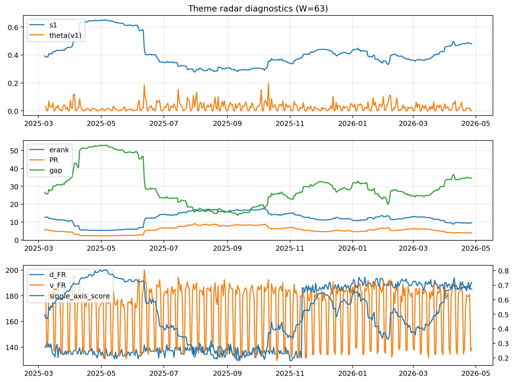

# Theme Radar Daily Brief — 2026-04-27

## Leaders (v1) — W=63
- **Nuclear_Uranium** (0.0740639039804257)
- Semis (0.0628779624376581)
- MegaCap_AI (0.0537534507929516)

## Challengers — W=63
**v2:** Software_Cloud (0.1125046751127772), Cyber (0.0740255639498814), Quantum (0.0672612067397454)
**v3:** Rates (0.1682120700592436), Semis (0.0803182045927882), Metals (0.0538080395454349)

## Migration (20D slope) — W=63
**Top risers:**
- axis_DataCenter_Infra: 0.0008048131646467
- axis_Rates: 0.0007863349949224
- axis_Commodities: 0.0003463372846047
- axis_MegaCap_AI: 0.000344697881576
- axis_Sector_Energy: 0.0002808651158824
- axis_Credit: 0.0001600723414069
- axis_Sector_ConsStap: 5.864903378121802e-05
- axis_Sector_RealEstate: 5.412312636905043e-05
- axis_USD: 5.0446780329449296e-05
- axis_Sector_Comm: 4.640303527859495e-05

**Top fallers:**
- axis_Space: -0.0001271991599826
- axis_Critical_Minerals: -0.0001609850210241
- axis_Crypto: -0.000185898189601
- axis_Semis: -0.0001900320155003
- axis_Genomics_Bio: -0.0001965167122967
- axis_Drones_Autonomy: -0.000248368501593
- axis_Cyber: -0.0002501688143365
- axis_Nuclear_Uranium: -0.0002522092162329
- axis_Software_Cloud: -0.0003369833966375
- axis_Quantum: -0.0003941079680451

## Risk line (W=63)
- s1: 0.4816690469734047
- theta_v1: 0.0002435427844255
- v_FR: 138.9911226232638
- single_axis_score: 0.6729016786570743

## Interpretation
**Regime:** `theme_migration`

- Action: Tomorrow watchlist: DataCenter_Infra, Rates, Commodities, MegaCap_AI, Sector_Energy + v2_top1=Software_Cloud
- Action: Hedge note: normal correlation stability.

- Percentiles (W=63 history): vfr_pct=0.25, theta_pct=0.11, s1_pct=0.82, score_pct=0.78.

---
**BUNDLE_ROOT_SHA256:** `e9d6572106d0fbb1150d1f33ae873bb8abfc4712b62fb736c7202b32fc58ec6c`
