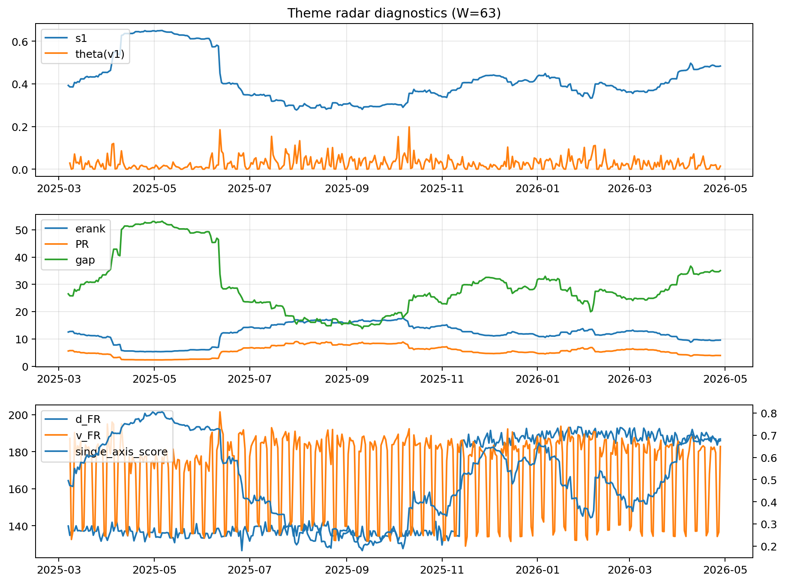

# Theme Radar Daily Brief — 2026-04-28

## Leaders (v1) — W=63
- **Nuclear_Uranium** (0.0732905965713063)
- Semis (0.0625820524421822)
- MegaCap_AI (0.053215205502602)

## Challengers — W=63
**v2:** Software_Cloud (0.1150575918572066), Cyber (0.0754691055457326), Quantum (0.0720046688246193)
**v3:** Rates (0.1702501294731373), Nuclear_Uranium (0.0692238419650393), Semis (0.0642916959583007)

## Migration (20D slope) — W=63
**Top risers:**
- axis_DataCenter_Infra: 0.0007919435209975
- axis_Rates: 0.0006896666154168
- axis_Commodities: 0.0002655527885755
- axis_MegaCap_AI: 0.0002582886638949
- axis_Sector_Energy: 0.0002223018499815
- axis_Credit: 0.000123951553252
- axis_USD: 4.473809756124302e-05
- axis_Sector_ConsStap: 3.614451169737632e-05
- axis_Sector_RealEstate: 3.101385768011494e-05
- axis_Sector_Comm: 2.4320431825454444e-05

**Top fallers:**
- axis_Clean_Broad: -0.000115691013613
- axis_Genomics_Bio: -0.000133129290763
- axis_Critical_Minerals: -0.0001408292877352
- axis_Grid_Power: -0.0001511913545181
- axis_Cyber: -0.0001720472775962
- axis_Drones_Autonomy: -0.0001869827746436
- axis_Software_Cloud: -0.0001995244977407
- axis_Semis: -0.0002475443621212
- axis_Nuclear_Uranium: -0.0002496806229865
- axis_Quantum: -0.0003162063649437

## Risk line (W=63)
- s1: 0.4834761374712036
- theta_v1: 0.0145986611082879
- v_FR: 182.86965872003984
- single_axis_score: 0.6755980861244019

## Interpretation
**Regime:** `theme_migration`

- Action: Tomorrow watchlist: DataCenter_Infra, Rates, Commodities, MegaCap_AI, Sector_Energy + v2_top1=Software_Cloud
- Action: Hedge note: normal correlation stability.

- Percentiles (W=63 history): vfr_pct=0.63, theta_pct=0.42, s1_pct=0.82, score_pct=0.80.

---
**BUNDLE_ROOT_SHA256:** `95ab81879784b761876da43096c65cded3407ba9e5539a3056d680d048b5f4b2`
