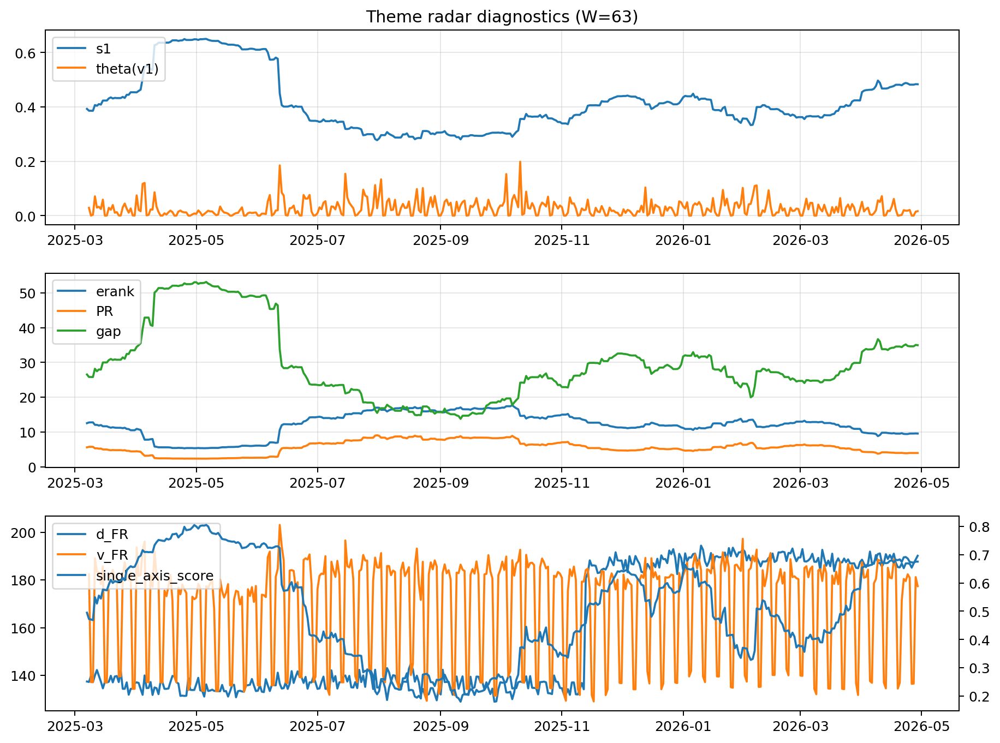

# Theme Radar Daily Brief — 2026-04-29

## Leaders (v1) — W=63
- **Nuclear_Uranium** (0.0734972833445852)
- Semis (0.063309547835055)
- MegaCap_AI (0.0525681218510549)

## Challengers — W=63
**v2:** Software_Cloud (0.1159597372212018), Cyber (0.07547102410122), Quantum (0.0715460269765097)
**v3:** Rates (0.168033070594987), Semis (0.0725571495469675), Nuclear_Uranium (0.0699003647469309)

## Migration (20D slope) — W=63
**Top risers:**
- axis_DataCenter_Infra: 0.0007795491013391
- axis_Rates: 0.0005771138010869
- axis_Commodities: 0.0002096217107137
- axis_Sector_Energy: 0.0001829777431765
- axis_MegaCap_AI: 0.0001755594852224
- axis_Metals: 8.709234696154082e-05
- axis_Credit: 8.280975627783146e-05
- axis_USD: 4.6128248949492974e-05
- axis_Sector_ConsStap: 3.1655281239628334e-05
- axis_Crypto: 3.02609170122932e-05

**Top fallers:**
- axis_Cyber: -0.0001014797515307
- axis_Software_Cloud: -0.0001095873449101
- axis_Genomics_Bio: -0.0001115983691944
- axis_Clean_Broad: -0.0001173295701827
- axis_Critical_Minerals: -0.0001242775469044
- axis_Drones_Autonomy: -0.000130524381337
- axis_Grid_Power: -0.0001727189055197
- axis_Nuclear_Uranium: -0.0002343599968921
- axis_Quantum: -0.0002556855120639
- axis_Semis: -0.0002920814393259

## Risk line (W=63)
- s1: 0.4831448132900212
- theta_v1: 0.0164146534690981
- v_FR: 177.38521436045357
- single_axis_score: 0.6754176610978521

## Interpretation
**Regime:** `theme_migration`

- Action: Tomorrow watchlist: DataCenter_Infra, Rates, Commodities, Sector_Energy, MegaCap_AI + v2_top1=Software_Cloud
- Action: Hedge note: normal correlation stability.

- Percentiles (W=63 history): vfr_pct=0.38, theta_pct=0.44, s1_pct=0.82, score_pct=0.80.

---
**BUNDLE_ROOT_SHA256:** `70bb53748c185ea89b45f72070e604ccc754f6266d47d8fb9f9dc3ba2b0315c1`
