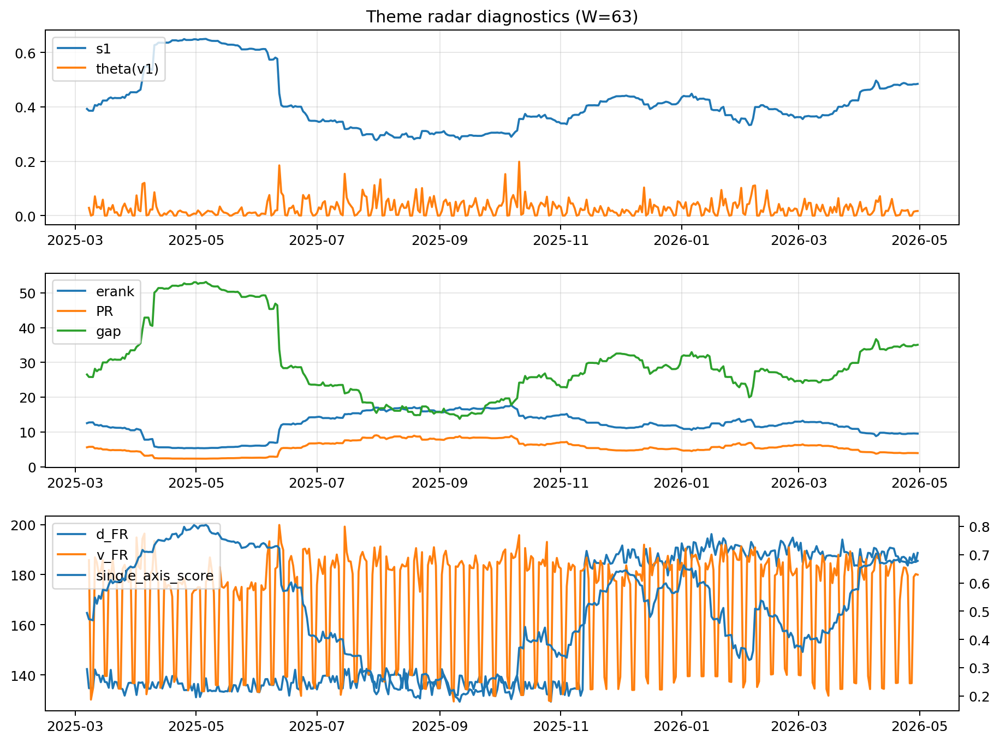

# Theme Radar Daily Brief — 2026-04-30

## Leaders (v1) — W=63
- **Nuclear_Uranium** (0.0738218654785583)
- Semis (0.0620536755817219)
- MegaCap_AI (0.0521905662849635)

## Challengers — W=63
**v2:** Software_Cloud (0.1151122898599733), Cyber (0.0747013025637777), Quantum (0.0699051507823939)
**v3:** Rates (0.1668236877969984), Semis (0.0829451278110978), Nuclear_Uranium (0.0600027038428378)

## Migration (20D slope) — W=63
**Top risers:**
- axis_DataCenter_Infra: 0.0007486198482306
- axis_Rates: 0.0005314327021589
- axis_Commodities: 0.000175686702369
- axis_Sector_Energy: 0.0001488242258991
- axis_Metals: 0.0001400218210709
- axis_Crypto: 0.0001005079085796
- axis_Credit: 6.278422748002428e-05
- axis_MegaCap_AI: 5.8927156721035326e-05
- axis_USD: 4.669017627150144e-05
- axis_Sector_ConsStap: 3.4945399381075776e-05

**Top fallers:**
- axis_Defense: -8.727526273695027e-05
- axis_Space: -8.965475191036271e-05
- axis_Genomics_Bio: -9.091854639711596e-05
- axis_Sector_Ind: -9.641109260521252e-05
- axis_Critical_Minerals: -0.0001199306268213
- axis_Clean_Broad: -0.0001317719401774
- axis_Grid_Power: -0.0001606065973051
- axis_Quantum: -0.000207191325364
- axis_Nuclear_Uranium: -0.0002188919487706
- axis_Semis: -0.0003033105874408

## Risk line (W=63)
- s1: 0.4845364986474123
- theta_v1: 0.0171402426606183
- v_FR: 179.99080055867307
- single_axis_score: 0.6780952380952381

## Interpretation
**Regime:** `theme_migration`

- Action: Tomorrow watchlist: DataCenter_Infra, Rates, Commodities, Sector_Energy, Metals + v2_top1=Software_Cloud
- Action: Hedge note: normal correlation stability.

- Percentiles (W=63 history): vfr_pct=0.47, theta_pct=0.46, s1_pct=0.82, score_pct=0.80.

---
**BUNDLE_ROOT_SHA256:** `7573efd258acd4a71534d6f964e9a3ef828c9266e48a3cbfc61bf4b99a57fa6c`
