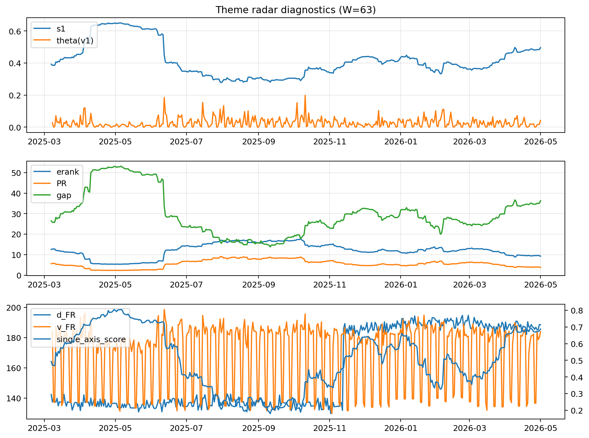

# Theme Radar Daily Brief — 2026-05-01

## Leaders (v1) — W=63
- **Nuclear_Uranium** (0.074636785132477)
- Semis (0.061908714166425)
- Genomics_Bio (0.0532300312999948)

## Challengers — W=63
**v2:** Software_Cloud (0.1178299655200708), Cyber (0.0770074599582749), Grid_Power (0.0649822351229288)
**v3:** Rates (0.1705745497888032), Nuclear_Uranium (0.0713916243652549), Semis (0.0664082668306018)

## Migration (20D slope) — W=63
**Top risers:**
- axis_DataCenter_Infra: 0.000653534888787
- axis_Rates: 0.0004955541238144
- axis_Metals: 0.0001914179303057
- axis_Commodities: 0.0001616204548899
- axis_Sector_Energy: 0.0001251277563338
- axis_Crypto: 0.000103336563473
- axis_USD: 5.482229081926248e-05
- axis_Credit: 4.926281436369936e-05
- axis_Miners: 3.836510936358869e-05
- axis_Sector_ConsStap: 3.7563422939832285e-05

**Top fallers:**
- axis_Defense: -8.363155113708089e-05
- axis_Software_Cloud: -8.403645730731245e-05
- axis_Equity_US: -8.91537347445977e-05
- axis_Sector_Ind: -9.053174269556408e-05
- axis_Critical_Minerals: -0.0001056353013309
- axis_Clean_Broad: -0.0001319708048233
- axis_Quantum: -0.000144373736453
- axis_Grid_Power: -0.0001556448415011
- axis_Nuclear_Uranium: -0.0001870675854082
- axis_Semis: -0.0003081267472842

## Risk line (W=63)
- s1: 0.4955808066721912
- theta_v1: 0.0417355470763761
- v_FR: 183.90111577843004
- single_axis_score: 0.6874109263657957

## Interpretation
**Regime:** `theme_migration`

- Action: Tomorrow watchlist: DataCenter_Infra, Rates, Metals, Commodities, Sector_Energy + v2_top1=Software_Cloud
- Action: Hedge note: normal correlation stability.

- Percentiles (W=63 history): vfr_pct=0.69, theta_pct=0.78, s1_pct=0.83, score_pct=0.82.

---
**BUNDLE_ROOT_SHA256:** `3f7f95ceb719175337aeacfe275867cf959636f66a619549b1f41598bfb36c34`
