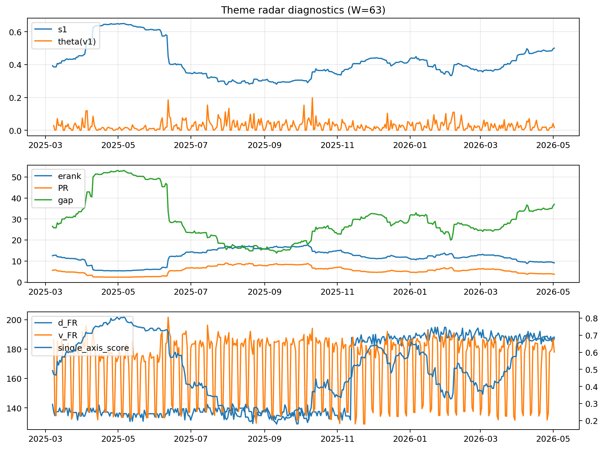

# Theme Radar Daily Brief — 2026-05-02

## Leaders (v1) — W=63
- **Nuclear_Uranium** (0.0741170324338588)
- Semis (0.0615530876538385)
- Genomics_Bio (0.0527351381452463)

## Challengers — W=63
**v2:** Software_Cloud (0.1245037828062133), Cyber (0.081235837837488), Grid_Power (0.0712765368978771)
**v3:** Rates (0.1732399291391907), Nuclear_Uranium (0.0983319617090139), Credit (0.0537238691883938)

## Migration (20D slope) — W=63
**Top risers:**
- axis_DataCenter_Infra: 0.0005522665155809
- axis_Rates: 0.0004589271948305
- axis_Metals: 0.0002536781301981
- axis_Commodities: 0.0001411787439921
- axis_Sector_Energy: 9.720492093331856e-05
- axis_Crypto: 9.623292549694014e-05
- axis_USD: 6.079558464266077e-05
- axis_Miners: 5.469121610437495e-05
- axis_Sector_ConsStap: 4.371948636442643e-05
- axis_Credit: 3.323172363145523e-05

**Top fallers:**
- axis_Sector_Ind: -8.414963756064323e-05
- axis_Cyber: -8.551037740780715e-05
- axis_Critical_Minerals: -8.607740051964852e-05
- axis_Equity_US: -9.178784128536824e-05
- axis_Software_Cloud: -0.000109085685315
- axis_MegaCap_AI: -0.0001242066408895
- axis_Clean_Broad: -0.0001253415725468
- axis_Grid_Power: -0.000150626022168
- axis_Nuclear_Uranium: -0.0001585678161791
- axis_Semis: -0.000309593465164

## Risk line (W=63)
- s1: 0.4999680714520976
- theta_v1: 0.0161657092895249
- v_FR: 177.94241749160338
- single_axis_score: 0.6886255924170616

## Interpretation
**Regime:** `theme_migration`

- Action: Tomorrow watchlist: DataCenter_Infra, Rates, Metals, Commodities, Sector_Energy + v2_top1=Software_Cloud
- Action: Hedge note: normal correlation stability.

- Percentiles (W=63 history): vfr_pct=0.41, theta_pct=0.44, s1_pct=0.84, score_pct=0.82.

---
**BUNDLE_ROOT_SHA256:** `805a66bd4281d7c9a3fecbdc591f723a219d611c310b9ad70b848caeffbe396d`
