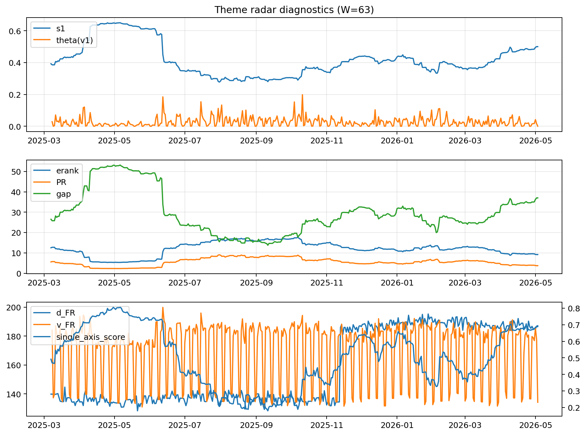

# Theme Radar Daily Brief — 2026-05-03

## Leaders (v1) — W=63
- **Nuclear_Uranium** (0.0741138749469993)
- Semis (0.0615518077149153)
- Genomics_Bio (0.0527331782572369)

## Challengers — W=63
**v2:** Software_Cloud (0.1244909025578258), Cyber (0.0812277385937874), Grid_Power (0.0712642121438267)
**v3:** Rates (0.1732317522998659), Nuclear_Uranium (0.098189850874607), Credit (0.0537184198634148)

## Migration (20D slope) — W=63
**Top risers:**
- axis_DataCenter_Infra: 0.0004325904515508
- axis_Rates: 0.0004066210924988
- axis_Metals: 0.0003097638410516
- axis_Commodities: 0.0001176684431314
- axis_Crypto: 8.478231642482164e-05
- axis_Miners: 7.061118373876833e-05
- axis_Sector_Energy: 6.665451797714547e-05
- axis_USD: 6.527378547813632e-05
- axis_Sector_ConsStap: 4.787220828561112e-05
- axis_Clean_Solar: 3.878510746210677e-05

**Top fallers:**
- axis_Defense: -7.624504502377171e-05
- axis_Sector_Tech: -7.886626597659275e-05
- axis_Equity_US: -9.110789983565132e-05
- axis_Cyber: -9.26669816326906e-05
- axis_Clean_Broad: -0.0001148684913841
- axis_Nuclear_Uranium: -0.0001250248176443
- axis_Software_Cloud: -0.0001297105342048
- axis_Grid_Power: -0.0001400865919748
- axis_MegaCap_AI: -0.0002055171104787
- axis_Semis: -0.0003017907604154

## Risk line (W=63)
- s1: 0.4999918401353379
- theta_v1: 0.0002701825885208
- v_FR: 134.1580319135696
- single_axis_score: 0.6888888888888889

## Interpretation
**Regime:** `theme_migration`

- Action: Tomorrow watchlist: DataCenter_Infra, Rates, Metals, Commodities, Crypto + v2_top1=Software_Cloud
- Action: Hedge note: normal correlation stability.

- Percentiles (W=63 history): vfr_pct=0.05, theta_pct=0.11, s1_pct=0.84, score_pct=0.83.

---
**BUNDLE_ROOT_SHA256:** `3b5b113a18417cb2ba06216456e9c0ff7334fb8b747ffd9c94f1a63fd27d7255`
