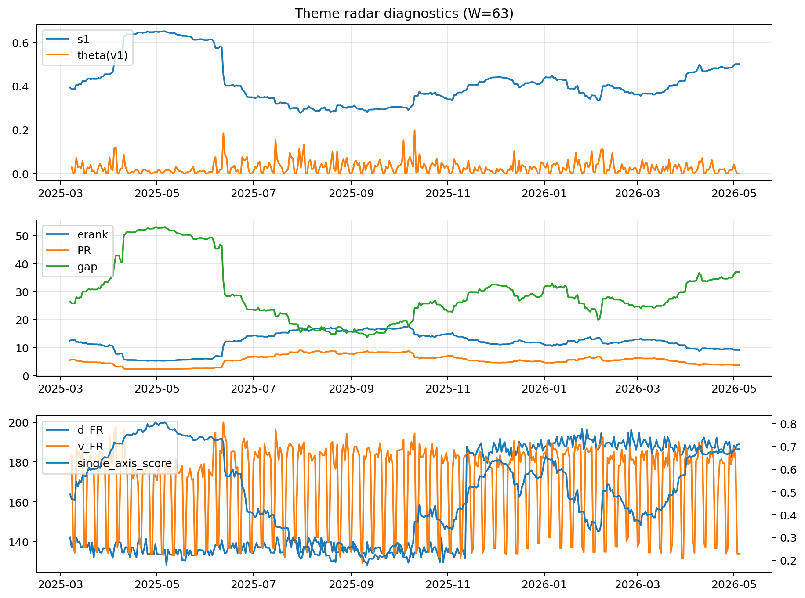

# Theme Radar Daily Brief — 2026-05-04

## Leaders (v1) — W=63
- **Nuclear_Uranium** (0.0741102980978086)
- Semis (0.0615468596490288)
- Genomics_Bio (0.0527315104822291)

## Challengers — W=63
**v2:** Software_Cloud (0.124492248305153), Cyber (0.0812271691030496), Grid_Power (0.0712776356885084)
**v3:** Rates (0.1732490272036763), Nuclear_Uranium (0.0983405531354195), Credit (0.0537274073652725)

## Migration (20D slope) — W=63
**Top risers:**
- axis_Rates: 0.0003487447430735
- axis_Metals: 0.000343961897005
- axis_DataCenter_Infra: 0.0002991600314907
- axis_Crypto: 8.632391360603847e-05
- axis_Commodities: 8.430696949705362e-05
- axis_Miners: 7.845163480659977e-05
- axis_USD: 6.631783361091873e-05
- axis_Drones_Autonomy: 6.100162734958496e-05
- axis_Quantum: 5.595538549253458e-05
- axis_Clean_Solar: 5.372535463203109e-05

**Top fallers:**
- axis_Defense: -6.881056814458245e-05
- axis_Sector_Tech: -8.116891313472688e-05
- axis_Equity_US: -8.722841150809848e-05
- axis_Cyber: -8.927293842041537e-05
- axis_Nuclear_Uranium: -9.084275303103956e-05
- axis_Clean_Broad: -0.000105528728814
- axis_Grid_Power: -0.0001281010843474
- axis_Software_Cloud: -0.0001350102674584
- axis_MegaCap_AI: -0.0002748384196682
- axis_Semis: -0.0002918884063684

## Risk line (W=63)
- s1: 0.5000253724401628
- theta_v1: 0.0004187371700011
- v_FR: 134.02971436510052
- single_axis_score: 0.6891509433962264

## Interpretation
**Regime:** `theme_migration`

- Action: Tomorrow watchlist: Rates, Metals, DataCenter_Infra, Crypto, Commodities + v2_top1=Software_Cloud
- Action: Hedge note: normal correlation stability.

- Percentiles (W=63 history): vfr_pct=0.05, theta_pct=0.15, s1_pct=0.84, score_pct=0.83.

---
**BUNDLE_ROOT_SHA256:** `c3232692ae596e67abedf33e5b0ca8edec67bec75a7428eb1ea711336c9c84ac`
