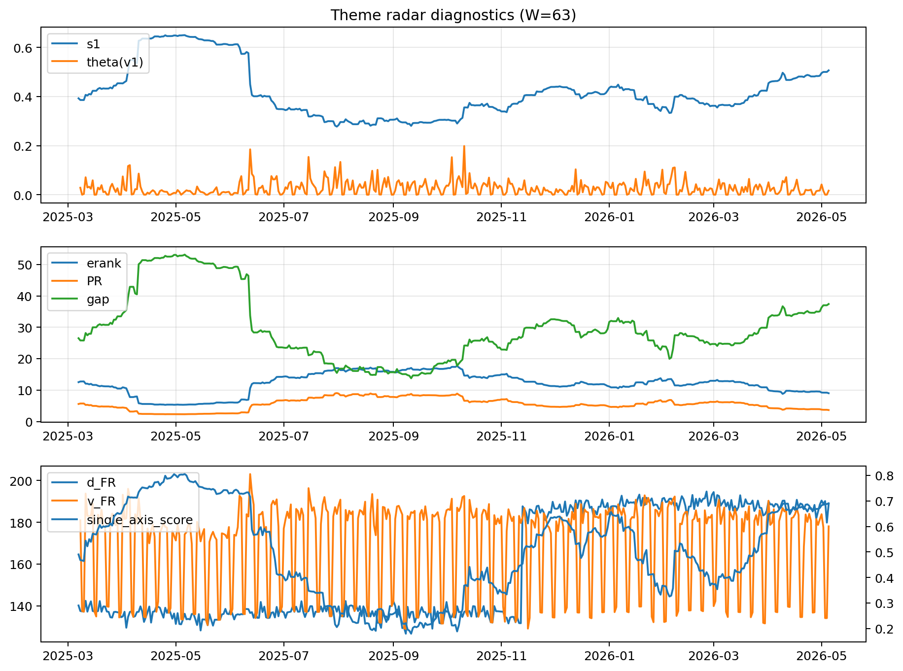

# Theme Radar Daily Brief — 2026-05-05

## Leaders (v1) — W=63
- **Nuclear_Uranium** (0.0748116563149029)
- Semis (0.0611777131870108)
- Genomics_Bio (0.051927971200815)

## Challengers — W=63
**v2:** Software_Cloud (0.1228095051076605), Cyber (0.0802168469952622), Grid_Power (0.0683277244553729)
**v3:** Rates (0.148575393947244), Semis (0.1268378131088439), Genomics_Bio (0.0592904486014852)

## Migration (20D slope) — W=63
**Top risers:**
- axis_Metals: 0.0003764169032767
- axis_Rates: 0.0003192834354951
- axis_DataCenter_Infra: 0.0001477692108834
- axis_Quantum: 0.0001169558442732
- axis_Drones_Autonomy: 0.0001056441496558
- axis_Miners: 8.176305866684862e-05
- axis_USD: 7.53547378309803e-05
- axis_Crypto: 7.198675058675165e-05
- axis_Clean_Solar: 6.743044140082585e-05
- axis_Sector_Health: 5.864330748763663e-05

**Top fallers:**
- axis_Sector_Ind: -5.3816344582570784e-05
- axis_Robotics: -6.665870556191523e-05
- axis_Sector_Tech: -8.404049553174961e-05
- axis_Equity_US: -8.752933461119568e-05
- axis_Cyber: -9.307510315534647e-05
- axis_Clean_Broad: -9.575212302309091e-05
- axis_Grid_Power: -0.000130251015028
- axis_Software_Cloud: -0.0001473150442344
- axis_Semis: -0.0002843664697812
- axis_MegaCap_AI: -0.0003321112012906

## Risk line (W=63)
- s1: 0.5063965040835525
- theta_v1: 0.0165992251336623
- v_FR: 178.04507759395528
- single_axis_score: 0.6908235294117647

## Interpretation
**Regime:** `theme_migration`

- Action: Tomorrow watchlist: Metals, Rates, DataCenter_Infra, Quantum, Drones_Autonomy + v2_top1=Software_Cloud
- Action: Hedge note: normal correlation stability.

- Percentiles (W=63 history): vfr_pct=0.41, theta_pct=0.45, s1_pct=0.84, score_pct=0.83.

---
**BUNDLE_ROOT_SHA256:** `ca9acb6273207c405ea05dbd4f9b5683deeffb65f3e1d27fb6ba01d9175b4c76`
