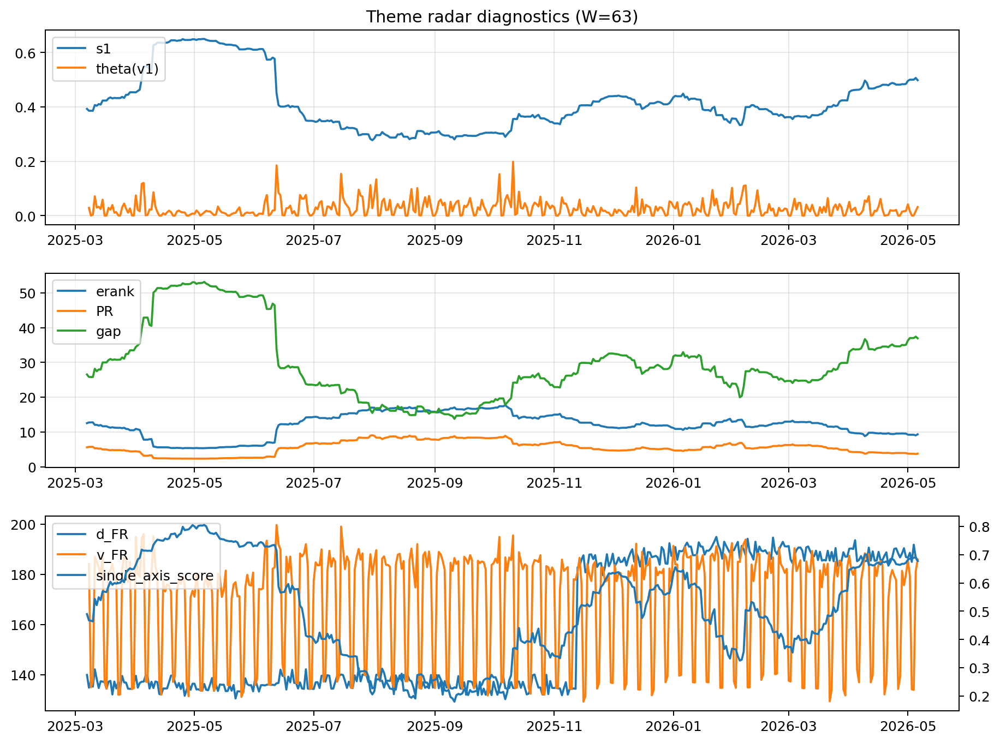

# Theme Radar Daily Brief — 2026-05-06

## Leaders (v1) — W=63
- **Nuclear_Uranium** (0.0732739027934898)
- Semis (0.0600568726951232)
- Genomics_Bio (0.0495941715527728)

## Challengers — W=63
**v2:** Software_Cloud (0.1233175720349771), Cyber (0.0799804717454732), Grid_Power (0.0708555732262995)
**v3:** Semis (0.1213301072585977), Genomics_Bio (0.0985056001849368), MegaCap_AI (0.0698474844717271)

## Migration (20D slope) — W=63
**Top risers:**
- axis_Metals: 0.0003830907563436
- axis_Rates: 0.0002877493275067
- axis_Drones_Autonomy: 0.0001741129287402
- axis_Quantum: 0.0001429792464605
- axis_USD: 8.009655427648043e-05
- axis_Miners: 7.917895228981034e-05
- axis_Clean_Solar: 7.41948209063555e-05
- axis_Sector_Health: 6.649492301797358e-05
- axis_Crypto: 6.354138665992087e-05
- axis_Sector_Fin: 4.6617366492234094e-05

**Top fallers:**
- axis_Sector_Ind: -4.719909964761049e-05
- axis_Robotics: -6.879074707184236e-05
- axis_Cyber: -7.432796859367232e-05
- axis_Equity_US: -8.4329013696993e-05
- axis_Sector_Tech: -8.605819516803052e-05
- axis_Clean_Broad: -9.010045770726722e-05
- axis_Software_Cloud: -0.0001305775192118
- axis_Grid_Power: -0.0001420721788571
- axis_Semis: -0.0002830293124882
- axis_MegaCap_AI: -0.0003651320429356

## Risk line (W=63)
- s1: 0.4979468804450378
- theta_v1: 0.0317308179391658
- v_FR: 185.94862146366145
- single_axis_score: 0.6784037558685445

## Interpretation
**Regime:** `theme_migration`

- Action: Tomorrow watchlist: Metals, Rates, Drones_Autonomy, Quantum, USD + v2_top1=Software_Cloud
- Action: Hedge note: normal correlation stability.

- Percentiles (W=63 history): vfr_pct=0.80, theta_pct=0.68, s1_pct=0.83, score_pct=0.81.

---
**BUNDLE_ROOT_SHA256:** `0820ed9ee0503a082ea43b789091afbf552cf6a3c5f7aff5f1a8c911a2a21261`
