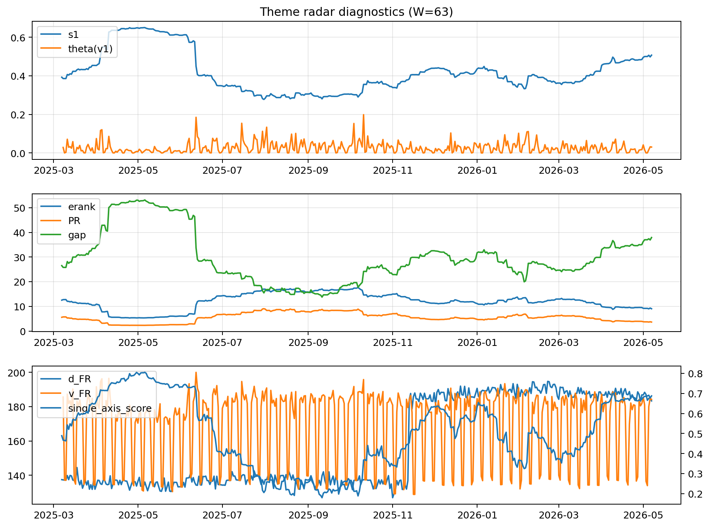

# Theme Radar Daily Brief — 2026-05-07

## Leaders (v1) — W=63
- **Nuclear_Uranium** (0.0743216417446828)
- Semis (0.0598815675727907)
- Genomics_Bio (0.0507930194437211)

## Challengers — W=63
**v2:** Software_Cloud (0.1276378435021414), Cyber (0.0827594201359845), Grid_Power (0.0696794693643274)
**v3:** Semis (0.116372779900894), Genomics_Bio (0.1008964953335464), MegaCap_AI (0.067536241208892)

## Migration (20D slope) — W=63
**Top risers:**
- axis_Metals: 0.0003805159207575
- axis_Rates: 0.000322580315078
- axis_Drones_Autonomy: 0.0002426539860231
- axis_Quantum: 0.0001605076693195
- axis_USD: 8.551139819211463e-05
- axis_Miners: 7.34804848481969e-05
- axis_Sector_Health: 6.672295875003531e-05
- axis_Clean_Solar: 6.440435268522612e-05
- axis_Sector_Fin: 4.6433854703528365e-05
- axis_Commodities: 4.416644096597184e-05

**Top fallers:**
- axis_Genomics_Bio: -4.289438532634465e-05
- axis_Robotics: -7.027357185968891e-05
- axis_Cyber: -8.374710549381004e-05
- axis_Sector_Tech: -8.887293409086527e-05
- axis_Equity_US: -9.03852246333878e-05
- axis_Clean_Broad: -0.0001035320394168
- axis_Software_Cloud: -0.0001554447358194
- axis_Grid_Power: -0.0001594868192402
- axis_Semis: -0.0003019258940257
- axis_MegaCap_AI: -0.0004069602753443

## Risk line (W=63)
- s1: 0.5071106923596755
- theta_v1: 0.0305507592992835
- v_FR: 184.22945839458055
- single_axis_score: 0.6875878220140514

## Interpretation
**Regime:** `theme_migration`

- Action: Tomorrow watchlist: Metals, Rates, Drones_Autonomy, Quantum, USD + v2_top1=Software_Cloud
- Action: Hedge note: normal correlation stability.

- Percentiles (W=63 history): vfr_pct=0.70, theta_pct=0.66, s1_pct=0.84, score_pct=0.83.

---
**BUNDLE_ROOT_SHA256:** `1eb88dc12f49d7db8b6f24b491679baf556aa6c8e435b070781336304296d416`
