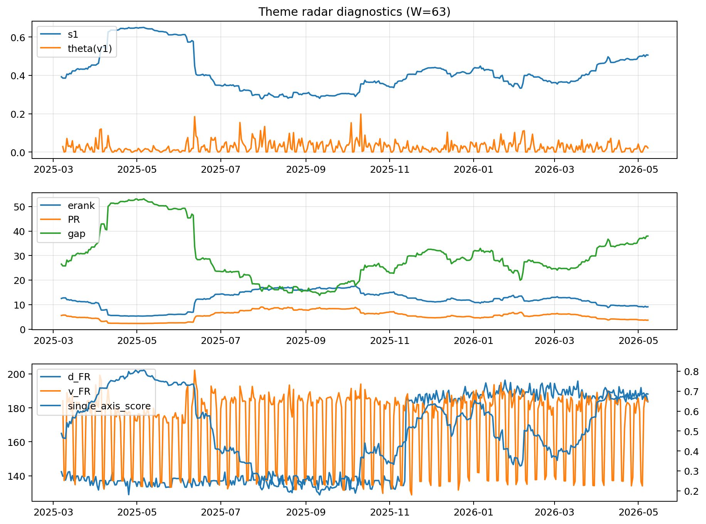

# Theme Radar Daily Brief — 2026-05-08

## Leaders (v1) — W=63
- **Nuclear_Uranium** (0.0745385977078299)
- Semis (0.0616465560286297)
- Genomics_Bio (0.0503772345585262)

## Challengers — W=63
**v2:** Software_Cloud (0.1302044658270873), Cyber (0.0845853899258435), Grid_Power (0.0747560295666211)
**v3:** Genomics_Bio (0.1029757263302639), Space (0.0813144141114393), Nuclear_Uranium (0.0810597249136993)

## Migration (20D slope) — W=63
**Top risers:**
- axis_Rates: 0.0003610713649919
- axis_Metals: 0.0003582759467661
- axis_Drones_Autonomy: 0.000286522790906
- axis_Quantum: 0.0001750670491604
- axis_USD: 8.749927860016895e-05
- axis_Miners: 6.514483397746887e-05
- axis_Sector_Health: 6.491479489648254e-05
- axis_Space: 5.356026104302648e-05
- axis_Clean_Solar: 5.3321301290572494e-05
- axis_Commodities: 5.156202293074954e-05

**Top fallers:**
- axis_Genomics_Bio: -5.111462064871492e-05
- axis_Robotics: -7.404950850849234e-05
- axis_Sector_Tech: -8.68304619192901e-05
- axis_Equity_US: -9.332688460566074e-05
- axis_Cyber: -0.0001106585616908
- axis_Clean_Broad: -0.0001160367948999
- axis_Grid_Power: -0.0001619670222174
- axis_Software_Cloud: -0.0001770059711758
- axis_Semis: -0.0002786144523254
- axis_MegaCap_AI: -0.0004159815582507

## Risk line (W=63)
- s1: 0.505526158035421
- theta_v1: 0.0216361029535531
- v_FR: 183.92097613086776
- single_axis_score: 0.6855140186915888

## Interpretation
**Regime:** `theme_migration`

- Action: Tomorrow watchlist: Rates, Metals, Drones_Autonomy, Quantum, USD + v2_top1=Software_Cloud
- Action: Hedge note: normal correlation stability.

- Percentiles (W=63 history): vfr_pct=0.67, theta_pct=0.54, s1_pct=0.84, score_pct=0.82.

---
**BUNDLE_ROOT_SHA256:** `1c38851f9352ec4e94a6c212316f14b31d9d08293f256ee6cc04fb16bfb5f737`
