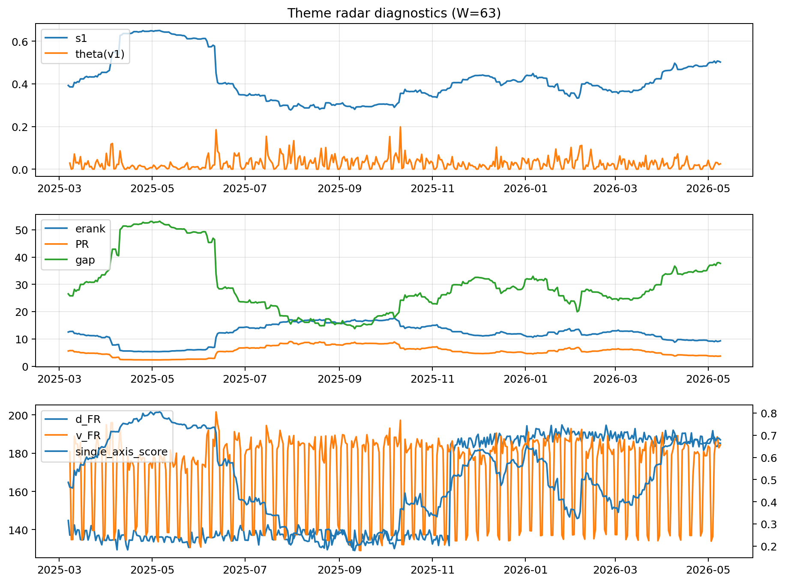

# Theme Radar Daily Brief — 2026-05-09

## Leaders (v1) — W=63
- **Nuclear_Uranium** (0.0727970697295373)
- Semis (0.0613256551530957)
- Genomics_Bio (0.0515681578646711)

## Challengers — W=63
**v2:** Software_Cloud (0.1282924519650925), Cyber (0.0828733521731961), Grid_Power (0.0753337510241945)
**v3:** Genomics_Bio (0.0928795071053004), Nuclear_Uranium (0.0926021452465139), Rates (0.0874957988281253)

## Migration (20D slope) — W=63
**Top risers:**
- axis_Rates: 0.0004080577935592
- axis_Metals: 0.0003518266739188
- axis_Drones_Autonomy: 0.0003369674872474
- axis_Quantum: 0.0001898971062102
- axis_USD: 9.074355962730495e-05
- axis_Miners: 5.889206810454255e-05
- axis_Sector_Health: 5.638450066130249e-05
- axis_Commodities: 5.397719453461976e-05
- axis_Space: 4.479342283676784e-05
- axis_Clean_Solar: 4.1582899846413904e-05

**Top fallers:**
- axis_Vol: -5.535691831338414e-05
- axis_Robotics: -7.894943253652882e-05
- axis_Sector_Tech: -8.49085103096312e-05
- axis_Equity_US: -9.30163341087389e-05
- axis_Cyber: -0.0001217166595608
- axis_Clean_Broad: -0.0001250542274857
- axis_Grid_Power: -0.0001679188612733
- axis_Software_Cloud: -0.0001905779050061
- axis_Semis: -0.0002537826971935
- axis_MegaCap_AI: -0.0004262642119539

## Risk line (W=63)
- s1: 0.5020295982992993
- theta_v1: 0.0253621335558004
- v_FR: 184.3106565294956
- single_axis_score: 0.6792540792540793

## Interpretation
**Regime:** `theme_migration`

- Action: Tomorrow watchlist: Rates, Metals, Drones_Autonomy, Quantum, USD + v2_top1=Software_Cloud
- Action: Hedge note: normal correlation stability.

- Percentiles (W=63 history): vfr_pct=0.72, theta_pct=0.58, s1_pct=0.83, score_pct=0.81.

---
**BUNDLE_ROOT_SHA256:** `13365aa892ed2fb32458ae913609146f67904e0055f7c0f5a23bbef917b2fb5f`
