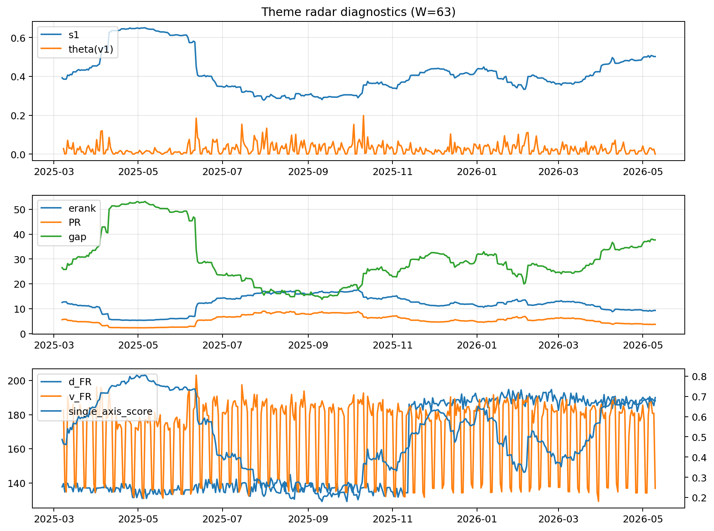

# Theme Radar Daily Brief — 2026-05-10

## Leaders (v1) — W=63
- **Nuclear_Uranium** (0.0727991170466556)
- Semis (0.0613241886614334)
- Genomics_Bio (0.051569621017811)

## Challengers — W=63
**v2:** Software_Cloud (0.1282915320463706), Cyber (0.0828656422224878), Grid_Power (0.0753437434617349)
**v3:** Genomics_Bio (0.0927911032784503), Nuclear_Uranium (0.0925982936638815), Rates (0.0877276930453021)

## Migration (20D slope) — W=63
**Top risers:**
- axis_Rates: 0.0004413778197737
- axis_Drones_Autonomy: 0.0003776813768951
- axis_Metals: 0.0003348514973361
- axis_Quantum: 0.0001989234595235
- axis_USD: 9.114830341648168e-05
- axis_Commodities: 5.443884312291449e-05
- axis_Miners: 5.07617706418252e-05
- axis_Sector_Health: 4.770675853906362e-05
- axis_Sector_ConsStap: 4.251923781345864e-05
- axis_Space: 3.7421924994598745e-05

**Top fallers:**
- axis_Sector_Tech: -8.084068470655101e-05
- axis_Robotics: -8.172470693090091e-05
- axis_Crypto: -9.008912987624988e-05
- axis_Equity_US: -9.031345291651536e-05
- axis_Cyber: -0.000129691144969
- axis_Clean_Broad: -0.0001302117531001
- axis_Grid_Power: -0.0001688352982421
- axis_Software_Cloud: -0.0001997428699908
- axis_Semis: -0.0002224856683651
- axis_MegaCap_AI: -0.0004280717296913

## Risk line (W=63)
- s1: 0.5020228207601024
- theta_v1: 0.0001352979034618
- v_FR: 136.8010584347587
- single_axis_score: 0.6786046511627907

## Interpretation
**Regime:** `theme_migration`

- Action: Tomorrow watchlist: Rates, Drones_Autonomy, Metals, Quantum, USD + v2_top1=Software_Cloud
- Action: Hedge note: normal correlation stability.

- Percentiles (W=63 history): vfr_pct=0.14, theta_pct=0.07, s1_pct=0.83, score_pct=0.81.

---
**BUNDLE_ROOT_SHA256:** `4abc95cc9e12cc3274e7f6e412a79e1add84225e0c694750546d98f49493ef0d`
