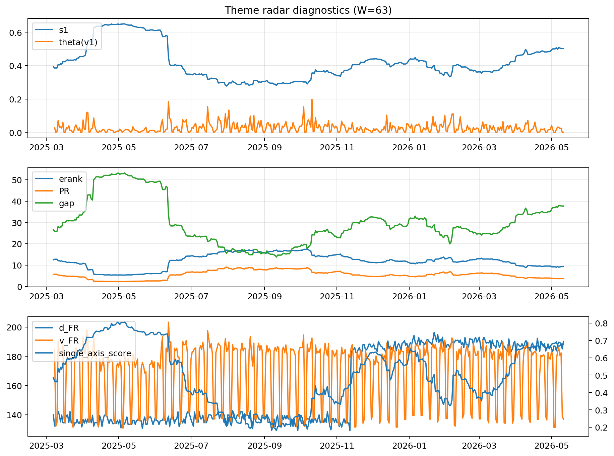

# Theme Radar Daily Brief — 2026-05-11

## Leaders (v1) — W=63
- **Nuclear_Uranium** (0.0728054983784053)
- Semis (0.0613222492353304)
- Genomics_Bio (0.0515737583101155)

## Challengers — W=63
**v2:** Software_Cloud (0.1282940776553589), Cyber (0.0828520904963881), Grid_Power (0.0753702180707099)
**v3:** Nuclear_Uranium (0.0925892384743698), Genomics_Bio (0.0925860866764849), Rates (0.0882610462540903)

## Migration (20D slope) — W=63
**Top risers:**
- axis_Rates: 0.0004619884036247
- axis_Drones_Autonomy: 0.0004087365999006
- axis_Metals: 0.0003078860294672
- axis_Quantum: 0.0002027192243159
- axis_USD: 8.8737059911244e-05
- axis_Defense: 5.838367362684431e-05
- axis_Commodities: 5.20043785766493e-05
- axis_Sector_ConsStap: 4.456610184173014e-05
- axis_Miners: 4.137270669724511e-05
- axis_Sector_Health: 3.795407677776762e-05

**Top fallers:**
- axis_Sector_Tech: -7.409138224078673e-05
- axis_Robotics: -8.131163362974033e-05
- axis_Equity_US: -8.437167104006898e-05
- axis_Crypto: -0.0001283890452815
- axis_Clean_Broad: -0.0001323060449566
- axis_Cyber: -0.0001350419286495
- axis_Grid_Power: -0.0001634277634391
- axis_Semis: -0.0001841381285984
- axis_Software_Cloud: -0.000206113514191
- axis_MegaCap_AI: -0.0004230243692457

## Risk line (W=63)
- s1: 0.5019954147701502
- theta_v1: 0.0003521013461038
- v_FR: 136.92963048486732
- single_axis_score: 0.677030162412993

## Interpretation
**Regime:** `theme_migration`

- Action: Tomorrow watchlist: Rates, Drones_Autonomy, Metals, Quantum, USD + v2_top1=Software_Cloud
- Action: Hedge note: normal correlation stability.

- Percentiles (W=63 history): vfr_pct=0.17, theta_pct=0.13, s1_pct=0.83, score_pct=0.80.

---
**BUNDLE_ROOT_SHA256:** `da8ff53ddbe46abf48089c5f3ac8a5e9af2faaa755a8301b2f810d0140cf3e9d`
