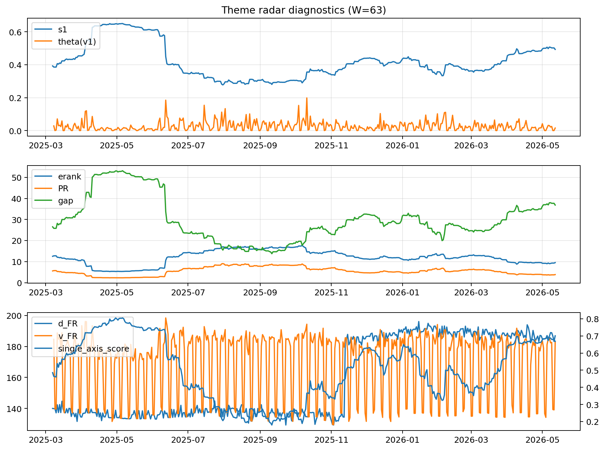

# Theme Radar Daily Brief — 2026-05-12

## Leaders (v1) — W=63
- **Nuclear_Uranium** (0.0729523821777957)
- Semis (0.0610428435022032)
- Genomics_Bio (0.051059001144185)

## Challengers — W=63
**v2:** Software_Cloud (0.1277337799296986), Cyber (0.0824715498540176), Grid_Power (0.0766205384540783)
**v3:** Rates (0.1193312283284769), Nuclear_Uranium (0.1067756057155685), Space (0.0752896429356577)

## Migration (20D slope) — W=63
**Top risers:**
- axis_Rates: 0.0004682727308895
- axis_Drones_Autonomy: 0.0004206350397437
- axis_Metals: 0.0002879760945219
- axis_Quantum: 0.000210084365888
- axis_USD: 8.967317502699907e-05
- axis_Defense: 8.799623872681168e-05
- axis_Sector_ConsStap: 4.683939553842373e-05
- axis_Commodities: 4.2193364559748025e-05
- axis_Miners: 4.06787186436857e-05
- axis_Sector_Health: 2.7928199124004724e-05

**Top fallers:**
- axis_Vol: -7.207404211116056e-05
- axis_Robotics: -7.279734595224352e-05
- axis_Equity_US: -7.63638993139516e-05
- axis_Clean_Broad: -0.0001361137705097
- axis_Cyber: -0.0001515679231292
- axis_Grid_Power: -0.0001624671314617
- axis_Semis: -0.0001635676873421
- axis_Crypto: -0.0001726115385331
- axis_Software_Cloud: -0.0002186964107335
- axis_MegaCap_AI: -0.0004177103913362

## Risk line (W=63)
- s1: 0.4929634632167587
- theta_v1: 0.0156448944863821
- v_FR: 182.91873539084972
- single_axis_score: 0.6685185185185185

## Interpretation
**Regime:** `theme_migration`

- Action: Tomorrow watchlist: Rates, Drones_Autonomy, Metals, Quantum, USD + v2_top1=Software_Cloud
- Action: Hedge note: normal correlation stability.

- Percentiles (W=63 history): vfr_pct=0.62, theta_pct=0.43, s1_pct=0.81, score_pct=0.79.

---
**BUNDLE_ROOT_SHA256:** `14432a081ba7b8ab858ef1dca7c7bc50319985eddcc9197b71edce448ca1d355`
