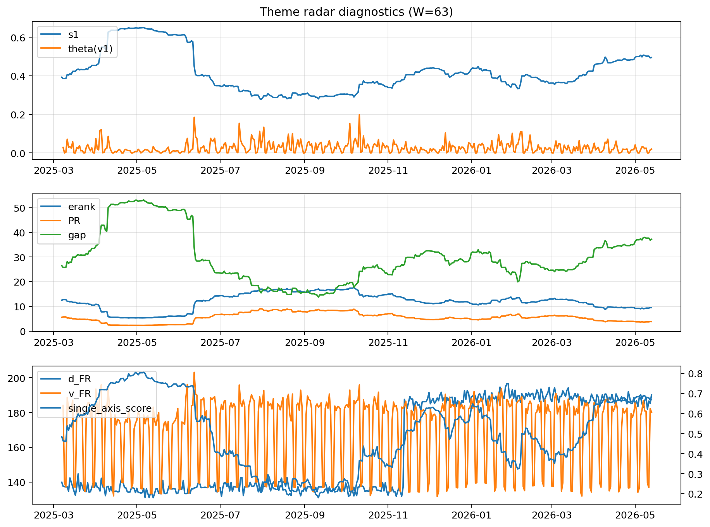

# Theme Radar Daily Brief — 2026-05-13

## Leaders (v1) — W=63
- **Nuclear_Uranium** (0.0735678993223735)
- Semis (0.0612227886362018)
- Genomics_Bio (0.0518972749893052)

## Challengers — W=63
**v2:** Software_Cloud (0.1302897027727881), Cyber (0.0846553735974604), Grid_Power (0.0749802001249222)
**v3:** Rates (0.1159232376807073), Nuclear_Uranium (0.1030814230756391), Space (0.0731814215059939)

## Migration (20D slope) — W=63
**Top risers:**
- axis_Rates: 0.0004810541411615
- axis_Drones_Autonomy: 0.000414540698808
- axis_Metals: 0.0002638064687013
- axis_Quantum: 0.0002095688290844
- axis_Defense: 9.58419417194535e-05
- axis_USD: 9.276649607980932e-05
- axis_Sector_ConsStap: 4.05764340654956e-05
- axis_Commodities: 3.567277236233247e-05
- axis_Miners: 3.557771853317187e-05
- axis_Sector_Energy: 2.26367535322622e-05

**Top fallers:**
- axis_Robotics: -6.418313202920569e-05
- axis_Equity_US: -7.23294993522334e-05
- axis_Vol: -8.238727760297794e-05
- axis_Clean_Broad: -0.0001331976443859
- axis_Semis: -0.0001383098000425
- axis_Grid_Power: -0.0001527357447549
- axis_Cyber: -0.0001584837014553
- axis_Crypto: -0.0001923617589766
- axis_Software_Cloud: -0.0002145277937737
- axis_MegaCap_AI: -0.0004005122687106

## Risk line (W=63)
- s1: 0.4948228244044501
- theta_v1: 0.0199457204961815
- v_FR: 180.11962019003167
- single_axis_score: 0.669284064665127

## Interpretation
**Regime:** `theme_migration`

- Action: Tomorrow watchlist: Rates, Drones_Autonomy, Metals, Quantum, Defense + v2_top1=Software_Cloud
- Action: Hedge note: normal correlation stability.

- Percentiles (W=63 history): vfr_pct=0.47, theta_pct=0.51, s1_pct=0.81, score_pct=0.79.

---
**BUNDLE_ROOT_SHA256:** `b79a24deaa935a5c12a06ecf2a962bd7963c88d8206845c84b997e2dd4f69a5f`
