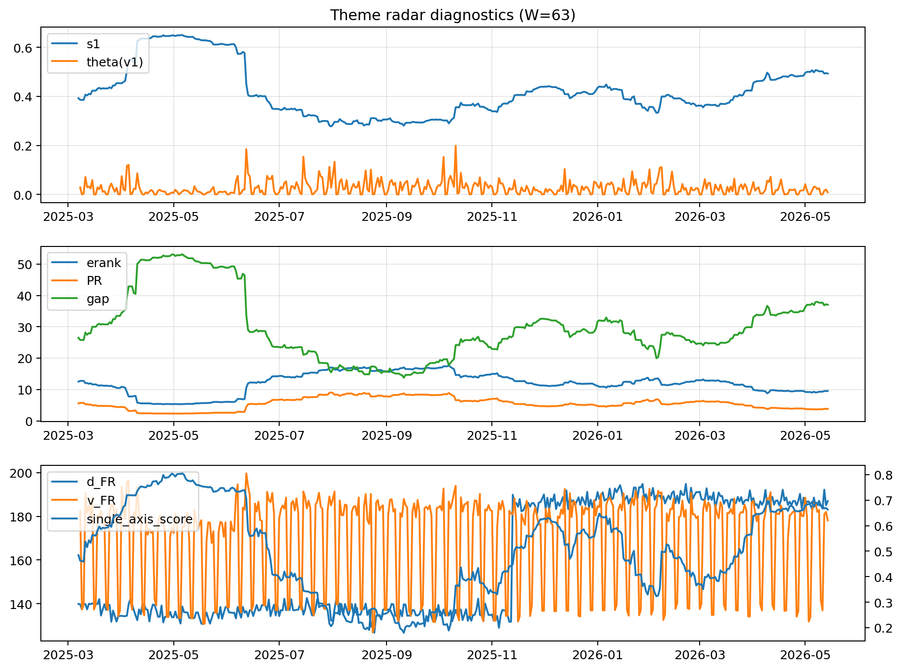

# Theme Radar Daily Brief — 2026-05-14

## Leaders (v1) — W=63
- **Nuclear_Uranium** (0.0734638082646367)
- Semis (0.0613660591913989)
- Genomics_Bio (0.052021882139005)

## Challengers — W=63
**v2:** Software_Cloud (0.1302339572436732), Cyber (0.0836394460315762), Grid_Power (0.0751022604893469)
**v3:** Nuclear_Uranium (0.1121098973640161), Rates (0.0978108426362092), Space (0.0688544298951095)

## Migration (20D slope) — W=63
**Top risers:**
- axis_Rates: 0.0004868451989055
- axis_Drones_Autonomy: 0.000398923065169
- axis_Metals: 0.0002348127850344
- axis_Quantum: 0.000202118250827
- axis_Defense: 0.0001062339431975
- axis_USD: 9.394672195962266e-05
- axis_Genomics_Bio: 4.671958910642e-05
- axis_Commodities: 3.1894903982648824e-05
- axis_Miners: 3.0322541262119213e-05
- axis_Sector_ConsStap: 2.529529470201517e-05

**Top fallers:**
- axis_Robotics: -5.4218907559947626e-05
- axis_Equity_US: -6.408421586420945e-05
- axis_Vol: -8.842791469912748e-05
- axis_Semis: -0.0001084256697009
- axis_Clean_Broad: -0.0001309509667055
- axis_Grid_Power: -0.0001459715881687
- axis_Cyber: -0.0001563034100104
- axis_Software_Cloud: -0.0002003389031949
- axis_Crypto: -0.0002072052786583
- axis_MegaCap_AI: -0.0003721021820577

## Risk line (W=63)
- s1: 0.4930317181913393
- theta_v1: 0.0086515203547631
- v_FR: 178.13194701775555
- single_axis_score: 0.6631336405529955

## Interpretation
**Regime:** `theme_migration`

- Action: Tomorrow watchlist: Rates, Drones_Autonomy, Metals, Quantum, Defense + v2_top1=Software_Cloud
- Action: Hedge note: normal correlation stability.

- Percentiles (W=63 history): vfr_pct=0.39, theta_pct=0.32, s1_pct=0.81, score_pct=0.78.

---
**BUNDLE_ROOT_SHA256:** `b5e7d0234dd158947973c4f04772fa8d25b1a2786eabbbb972955317ee3bef2e`
