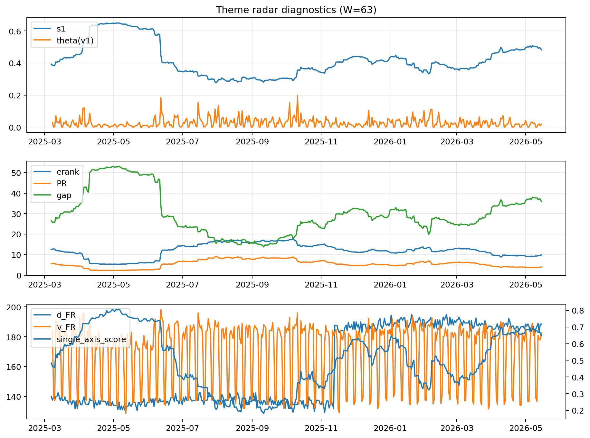

# Theme Radar Daily Brief — 2026-05-15

## Leaders (v1) — W=63
- **Nuclear_Uranium** (0.0749871171319023)
- Semis (0.0605493711711823)
- Genomics_Bio (0.0513702665818242)

## Challengers — W=63
**v2:** Software_Cloud (0.128719437202307), Cyber (0.0826562605551252), Grid_Power (0.0720325281514314)
**v3:** Rates (0.1118110381395831), Nuclear_Uranium (0.1041009274972261), Quantum (0.0699248750233548)

## Migration (20D slope) — W=63
**Top risers:**
- axis_Rates: 0.0004849810885972
- axis_Drones_Autonomy: 0.0003937452206447
- axis_Metals: 0.0002056912742481
- axis_Quantum: 0.0001940518945176
- axis_Defense: 0.0001132645597386
- axis_USD: 9.183506833075836e-05
- axis_Genomics_Bio: 3.4021116863778256e-05
- axis_Miners: 2.702750774037001e-05
- axis_DataCenter_Infra: 2.6265285585879404e-05
- axis_Sector_Energy: 2.505055140847865e-05

**Top fallers:**
- axis_Critical_Minerals: -5.75156682200583e-05
- axis_Sector_Health: -6.078604147118232e-05
- axis_Vol: -9.270063535013988e-05
- axis_Semis: -0.0001055215317431
- axis_Clean_Broad: -0.0001226274737042
- axis_Grid_Power: -0.000129989572812
- axis_Cyber: -0.0001476079406748
- axis_Software_Cloud: -0.0001877204169256
- axis_Crypto: -0.0002120678590876
- axis_MegaCap_AI: -0.0003462558651838

## Risk line (W=63)
- s1: 0.482196224393806
- theta_v1: 0.0183067103179277
- v_FR: 182.65124624695957
- single_axis_score: 0.646896551724138

## Interpretation
**Regime:** `theme_migration`

- Action: Tomorrow watchlist: Rates, Drones_Autonomy, Metals, Quantum, Defense + v2_top1=Software_Cloud
- Action: Hedge note: normal correlation stability.

- Percentiles (W=63 history): vfr_pct=0.60, theta_pct=0.48, s1_pct=0.79, score_pct=0.74.

---
**BUNDLE_ROOT_SHA256:** `e4c52ef64a70d735a0714383b69102f58ac53c833dcd092175263e21380a07ad`
