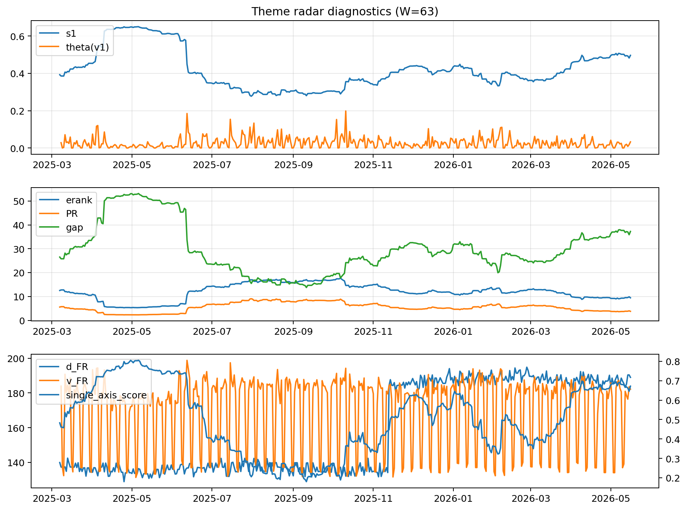

# Theme Radar Daily Brief — 2026-05-16

## Leaders (v1) — W=63
- **Nuclear_Uranium** (0.0749076369003906)
- Semis (0.0611693681979772)
- Genomics_Bio (0.0508928216779518)

## Challengers — W=63
**v2:** Software_Cloud (0.1324018231534432), Cyber (0.0852067052120799), Grid_Power (0.0695867571327943)
**v3:** Nuclear_Uranium (0.1089120702821982), Rates (0.1088816376556782), Quantum (0.0683220305164647)

## Migration (20D slope) — W=63
**Top risers:**
- axis_Rates: 0.0004909777796898
- axis_Drones_Autonomy: 0.0003828747557091
- axis_Quantum: 0.0001904899589162
- axis_Metals: 0.0001744346400753
- axis_Defense: 0.0001180943399318
- axis_USD: 8.937915318419378e-05
- axis_DataCenter_Infra: 5.2277433151139306e-05
- axis_Credit: 3.223793624632908e-05
- axis_Sector_Energy: 3.188470634015112e-05
- axis_Sector_RealEstate: 2.948355178029144e-05

**Top fallers:**
- axis_Critical_Minerals: -6.601043740462063e-05
- axis_Sector_Health: -8.918988099115285e-05
- axis_Semis: -9.025825045983437e-05
- axis_Vol: -9.472213424242496e-05
- axis_Grid_Power: -0.0001090501658924
- axis_Clean_Broad: -0.0001127919783741
- axis_Cyber: -0.0001522091135585
- axis_Crypto: -0.0001916121271217
- axis_Software_Cloud: -0.0001986416340231
- axis_MegaCap_AI: -0.0003458554909968

## Risk line (W=63)
- s1: 0.4964423827126641
- theta_v1: 0.0329338059219884
- v_FR: 182.180470711204
- single_axis_score: 0.6720183486238531

## Interpretation
**Regime:** `theme_migration`

- Action: Tomorrow watchlist: Rates, Drones_Autonomy, Quantum, Metals, Defense + v2_top1=Software_Cloud
- Action: Hedge note: normal correlation stability.

- Percentiles (W=63 history): vfr_pct=0.58, theta_pct=0.70, s1_pct=0.82, score_pct=0.80.

---
**BUNDLE_ROOT_SHA256:** `5e9ce99c7b77303c109f55c2d216af277635e79d6e0a831d645b6a2338af8525`
